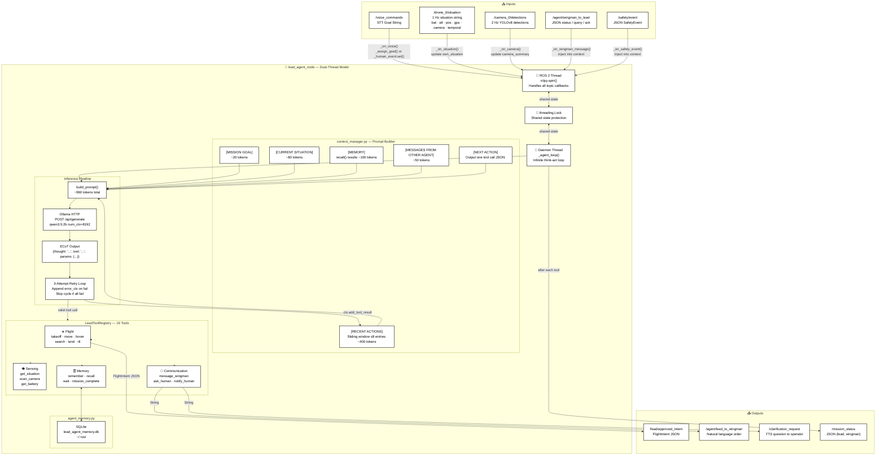
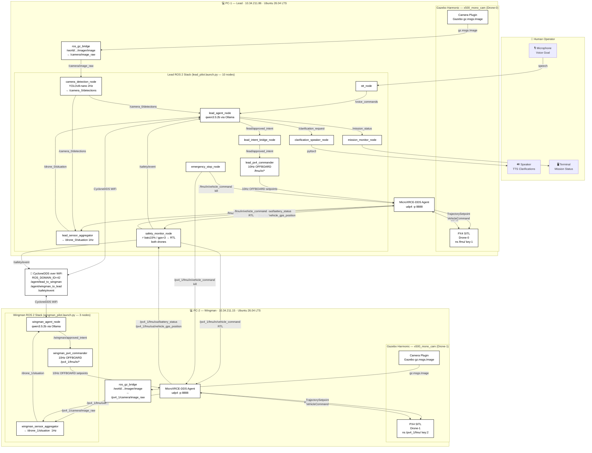

# Diagram 1 — Pilot Agent Architecture

> Focuses on the internal intelligence pipeline of one agent (Lead shown; Wingman is symmetric).

---

# Diagram 2 — Complete System Architecture

> PC-to-PC deployment topology: PX4, Gazebo, ROS 2, DDS bridges, and both agent stacks.

