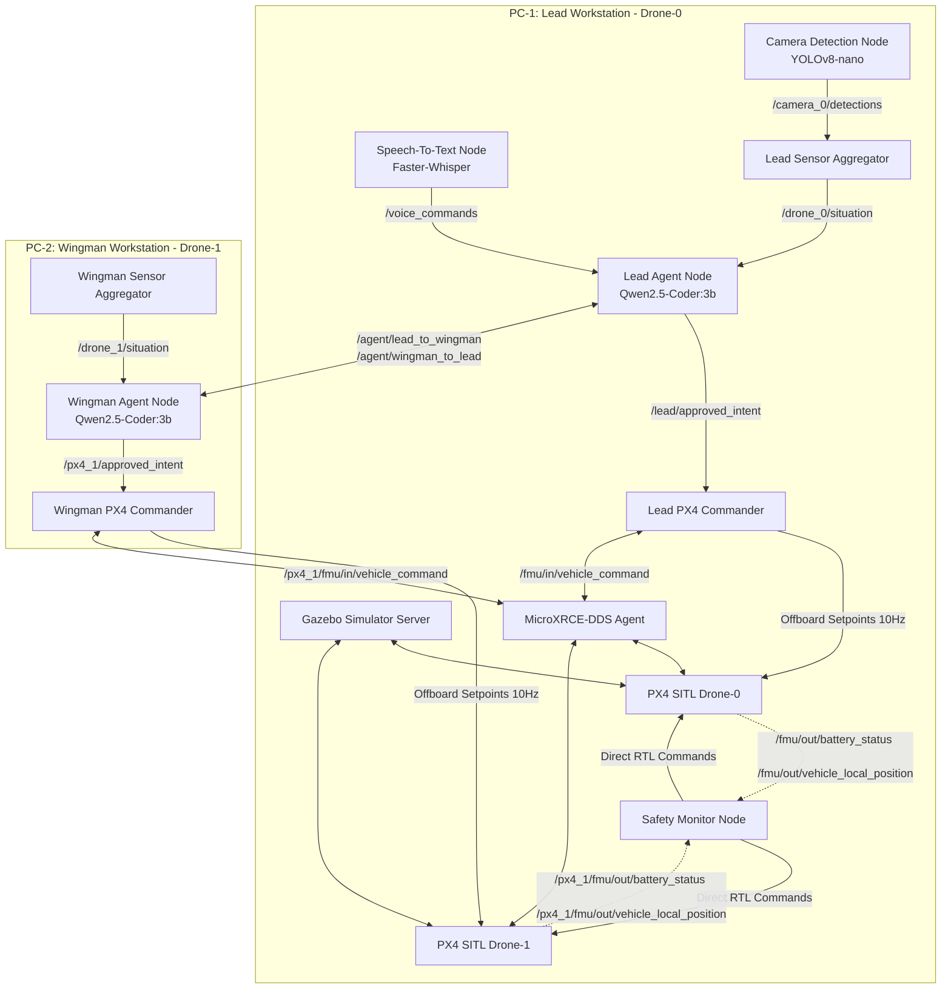

# Multi-Drone SLM Pilot System — Comprehensive Tutorial Analysis

This document provides a technical and structural analysis of the **Multi-Drone SLM Pilot System** based on the consolidated [tutorial_merged.md](file:///Users/devrajsinhgohil/Desktop/Major-1/CODE/tutorial_merged.md). The system is a rank-based multi-agent small language model (SLM) drone control system designed for offline execution on edge computers (distributed across two PCs over WiFi) running ROS2 Lyrical, PX4 Autopilot SITL, and Gazebo.

---

## 1. System Topology & Hardware/Software Stack

The system distributes task complexity across two machines connected via CycloneDDS over a local WiFi network:



### Environment Configuration

*   **Operating System:** Ubuntu 26.04 LTS (utilizing a GCC 15 environment).
*   **ROS2 Distro:** ROS2 Lyrical (utilizing `ament_python` as the build tool for custom nodes).
*   **DDS Middleware:** CycloneDDS (explicitly preferred over FastDDS for better multicast reliability over WiFi).
*   **Local LLM Engine:** Ollama running `qwen3.5:2b` (quantized to 8-bit, running offline).
*   **Simulator & Flight Stack:** PX4 Autopilot SITL connected to a shared Gazebo simulation server.
*   **DDS Bridge:** MicroXRCE-DDS Agent running on port `8888` serving UDP channels.

---

## 2. Core Architectural Patterns

### A. Decoupled Real-Time Flight Loop (10 Hz Heartbeat)
A fundamental constraint of PX4 Offboard Mode is that the flight controller requires continuous setpoint updates at a rate **greater than 2 Hz**. If setpoints cease, PX4 fails safe by dropping out of offboard mode. 
Because SLM inference (Ollama text generation) is highly variable and takes anywhere from **500ms to 2000ms**, the agent cannot publish setpoints directly.

*   **Solution:** The system decouples command logic from the execution loop.
*   **Implementation:** 
    *   The `LeadPX4CommanderNode` and `WingmanPX4CommanderNode` run a fast ROS2 timer at **10 Hz** (every 100ms) which repeatedly publishes the `OffboardControlMode` heartbeat and the *last known target position* (`TrajectorySetpoint`).
    *   The slow NLU/Agent loop runs asynchronously in a background thread, updating the commander's target coordinates (`target_x`, `target_y`, `target_z`) only when a new schema-validated command is successfully parsed.

### B. Grounded Situational Awareness via Text Aggregation
Small Language Models at 3B parameters cannot process raw camera matrices or binary telemetry streams directly.
*   **Solution:** Pre-processed telemetry aggregation.
*   **Implementation:**
    *   **Perception:** `camera_detection_node.py` runs YOLOv8-nano on `/camera/image_raw` and publishes detection summaries (e.g., `"landing_pad:northeast:4.5m"`).
    *   **Aggregation:** `sensor_aggregator_node.py` collects GPS fix data, battery percentages, barometric altitudes, local Cartesian coords (NED frame), and YOLO outputs.
    *   **Prompt Formatting:** It serializes these into a compact, human-readable string:
        ```text
        [DRONE | LEAD] pos:(5.0,2.1,-10.0m) hdg:90° spd:0.0m/s bat:88% mode:OFFBOARD baro:10.0m gps:OK
        [CAMERA | LEAD] landing_pad at 4.5m NE
        ```
    *   This string is injected directly into the SLM prompt context every cycle, grounding the model's actions in real-world states.

### C. Hard-Rule Safety Monitor (Bypassing SLM)
To ensure safety in life-critical scenarios, the system avoids relying on the SLM for emergency decisions.
*   **Solution:** An independent C++ or Python node (`safety_monitor_node.py`) runs standard algorithmic loops to monitor critical limits.
*   **Implementation:**
    *   **Warning (Battery ≤ 20%):** Publishes warning events to `/safety/event` and triggers speech output via the GCS Text-to-Speech node.
    *   **Critical RTL (Battery ≤ 15%):** Directly publishes the `VEHICLE_CMD_NAV_RETURN_TO_LAUNCH` command to PX4 (`/fmu/in/vehicle_command`), bypassing the NLU pipeline entirely.
    *   To ensure message delivery, the monitor publishes the command **three times** consecutively (belt-and-suspenders pattern).

---

## 3. Communication Protocols & Pydantic Schemas

To resolve the issue of LLMs hallucinating or producing erratic natural language coordination, all control paths utilize strict Pydantic v2 validation models defined in `common/schemas.py`.

```
Ground Commander
     │
     │ /voice_commands (STT English audio -> text string)
     ▼
Lead Agent Node ──[Qwen2.5-Coder:3b]──> Generates LeadOutput JSON
     │
     ├── (If Lead Intent exists) ──> publishes FlightIntent JSON -> /lead/approved_intent
     │
     └── (If Wingman Order exists) ──> publishes WingmanOrder JSON -> /agent/lead_to_wingman
                                                │
                                                ▼
                                         Wingman Agent Node ──[Qwen2.5-Coder:3b]──> Generates WingmanOutput JSON
                                                │
                                                └── publishes FlightIntent JSON -> /px4_1/approved_intent
```

### A. Token Mitigation via Abbreviated Value Expansion
Prompt token count directly affects SLM execution speed. To keep responses small and speed up inference, the system implements a compact abbreviation mechanism (`expand_compact_values`).
*   **SLM Output:** The model outputs shortened codes like `"H"` (high), `"FWD"` (forward), and `"U"` (urgent).
*   **Parser Action:** Before feeding the raw JSON to the Pydantic parser, a recursive mapper expands these abbreviations to their full schema strings (`"high"`, `"forward"`, `"urgent"`).

### B. Core Schema Specifications

| Schema Name | Sender | Receiver | Core Payload Fields |
|---|---|---|---|
| `FlightIntent` | Agent Node | PX4 Commander | `action` (takeoff/move/hover/rtl/land/search), `altitude`, `distance`, `direction`, `speed`, `heading`, `then` (nested sequential actions), `confidence` (high/medium/low) |
| `WingmanOrder` | Lead Agent | Wingman Agent | `order_id`, `mission_context` (NL brief), `intent` (nested `FlightIntent`), `priority` (routine/urgent/emergency), `lead_position`, `confidence` |
| `StatusReport` | Wingman Agent | Lead Agent | `order_id`, `status` (acknowledged/executing/completed/failed/needs_clarification), `drone_position`, `battery_pct`, `obstacle_detected`, `situation_summary` (NL) |
| `LeadOutput` | Lead SLM | Lead Loop | `my_intent` (optional `FlightIntent`), `wingman_order` (optional `WingmanOrder`), `confidence`, `situation_report` (NL), `clarification_question` |

---

## 4. Two-Level Confidence Gating (Clarification Cascade)

Ambiguity is handled by propagating clarification requests up the command hierarchy. Rather than entering a failed or guessed flight state, agents trigger voice or text prompt dialogues:

```
[Human Operator] ◄───(asks clarification via GCS TTS)─── [Lead Agent] ◄───(asks via /agent/wingman_to_lead)─── [Wingman Agent]
       │                                                         ▲                                                 ▲
       └───────(clarifies order via voice commands STT)──────────┴──────(translates / forwards clarification)──────┘
```

1.  **Wingman Gate:** If the Wingman Agent receives an order from the Lead but parses it with `confidence: "low"`, it calls the `ask_lead` tool. The Wingman's execution loop blocks for up to **60 seconds** waiting for a response on the `/agent/lead_to_wingman` topic.
2.  **Lead Gate:** 
    *   If the Lead receives a clarification request from the Wingman, it marks `wingman_query_pending` and generates an answer in its next inference cycle.
    *   If the Lead itself receives an ambiguous command from the Human Ground Commander, it calls the `ask_human` tool. This blocks the Lead's thread for up to **120 seconds**, publishing the question to `/clarification_request` (routed to the GCS Text-to-Speech speaker).
    *   The Lead's loop stays blocked until the human speaks the answer (processed via Speech-to-Text and published to `/voice_commands`), triggering an event release.

---

## 5. Deployment Setup & Step-by-Step Sequence

To run this multi-agent distributed system, the deployment sequence must be strictly followed in order:

### Step 1: Network Integration (Both PCs)
Verify that PC-1 and PC-2 are on the same subnet and configure `/etc/cyclonedds/cyclonedds.xml` with peer unicast IP listings to prevent WiFi packet loss issues typical of multicast. Export the same `ROS_DOMAIN_ID=42`.

### Step 2: Launch Gazebo & PX4 SITL (PC-1)
```bash
# Terminal 1: Launch the single simulation server and Drone-0
cd ~/PX4-Autopilot
make px4_sitl gz_x500_mono_cam
```
```bash
# Terminal 2: Launch Drone-1 (starts inside the same Gazebo world, namespace /px4_1/)
cd ~/PX4-Autopilot
PX4_SYS_AUTOSTART=4001 PX4_GZ_MODEL_POSE="3,3,0,0,0,0" ./build/px4_sitl_default/bin/px4 -i 1
```

### Step 3: Run MicroXRCE Agent (PC-1)
Starts the bridge between PX4 UDP channels and ROS2 DDS:
```bash
MicroXRCEAgent udp4 -p 8888
```

### Step 4: Run Lead Pilot Nodes (PC-1)
Launches the STT pipeline, YOLO camera detection, Lead sensor aggregator, safety monitor, and the Lead SLM Agent Node:
```bash
source ~/major_ws/install/setup.bash
ros2 launch major_project lead_pilot.launch.py config_file:=~/major_ws/src/major_project/config/lead_config.yaml
```

### Step 5: Run Wingman Pilot Nodes (PC-2)
Launches the Wingman sensor aggregator, Wingman commander, and the Wingman SLM Agent Node:
```bash
source ~/major_ws/install/setup.bash
ros2 launch major_project wingman_pilot.launch.py config_file:=~/major_ws/src/major_project/config/wingman_config.yaml
```

---

## 6. Critical Technical Pitfalls & Fixes

Based on compiling and launching this setup in modern Ubuntu environments, several critical workarounds must be implemented:

### A. GCC 15 false-positive compiler errors (Ubuntu 26.04)
*   **Problem:** Building PX4 SITL triggers `-Wmaybe-uninitialized` warnings in the Gazebo plugins, causing the build to fail.
*   **Fix:** Downgrade the warning to a warning in the cmake build invocation:
    ```bash
    cmake build/px4_sitl_default -DCMAKE_CXX_FLAGS="-Wno-error=maybe-uninitialized"
    make px4_sitl
    ```

### B. Stack Smashing on MicroXRCE-DDS Agent (Ubuntu 26.04)
*   **Problem:** Building the DDS agent without adjusting stack protection features causes a segmentation fault (`stack smashing detected`) at runtime.
*   **Fix:** Compile the agent with stack protection flags disabled:
    ```bash
    cmake .. -DCMAKE_BUILD_TYPE=Release -DCMAKE_CXX_FLAGS="-fno-stack-protector -D_FORTIFY_SOURCE=0" -DCMAKE_C_FLAGS="-fno-stack-protector -D_FORTIFY_SOURCE=0"
    make -j$(nproc)
    ```

### C. ROS2 Lyrical Python Workspace build issues (`empy`)
*   **Problem:** ROS2 Lyrical relies on the python package `empy` version **3.x**. If pip installs the newer **4.x** version, the PX4 and custom message generation packages will fail to compile.
*   **Fix:** Force install the older version inside the active workspace virtual environment:
    ```bash
    pip install 'empy==3.3.4' --force-reinstall
    ```

### D. System Python packages visibility in Venv
*   **Problem:** ROS2 packages require access to standard workspace packages like `catkin_pkg` and `rosidl_adapter`. Standard python virtual environments block access to these.
*   **Fix:** When building the virtual environment, use the site-packages flag:
    ```bash
    python3 -m venv .venv --system-site-packages
    ```

---

## 7. Latency Metrics & Architectural Decision Matrix

The tutorial provides a diagnostic script (`latency_benchmark.py`) to measure Ollama's inference performance. 

> [!IMPORTANT]
> The latency of `qwen3.5:2b` dictates the choice of NLU communication architecture:

| Mean Latency (ms) | Severity | Required NLU Execution Architecture |
|---|---|---|
| **< 400 ms** | Green | **Synchronous NLU:** Simple design; SLM runs directly within the ROS2 callbacks. |
| **400 - 800 ms** | Yellow | **Asynchronous NLU:** SLM runs in a separate background thread; the commander node sends keepalives and targets at 10 Hz independently. |
| **> 800 ms** | Red | **Degraded Mode:** Switch to a smaller model (e.g., `qwen3.5:1.5b`) and reduce context limits (`num_ctx=256`). |
