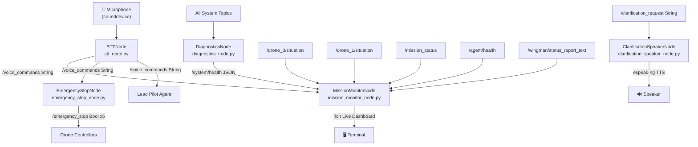

# Part 4: Ground Control Station (GCS) Nodes

This part covers all five Ground Control Station nodes that provide the human interface layer for the drone swarm system. These nodes handle voice input, spoken feedback, live mission dashboards, emergency controls, and system health diagnostics.



---

## Directory Structure

```
ros2_ws/src/gcs/
├── gcs/
│   ├── __init__.py
│   ├── stt_node.py
│   ├── clarification_speaker_node.py
│   ├── mission_monitor_node.py
│   ├── emergency_stop_node.py
│   └── diagnostics_node.py
├── package.xml
├── setup.py
└── setup.cfg
```

> [!IMPORTANT]
> Install system dependencies before proceeding:
> ```bash
> pip install faster-whisper sounddevice rich
> sudo apt-get install -y espeak-ng
> ```

---

## 4.1 STT Node (`gcs/stt_node.py`)

The Speech-To-Text node records audio from the microphone using `sounddevice`, detects voice activity via RMS energy, and transcribes completed utterances with `faster-whisper`. Transcribed text is published to `/voice_commands`.

**Key design decisions:**
- 0.5 s chunk size for low-latency VAD response
- RMS silence threshold `0.01` (empirically tuned for quiet office)
- 1.5 s post-speech silence triggers transcription
- 1.0 s minimum speech duration avoids spurious one-word triggers
- Falls back to stdin polling when `sounddevice` is unavailable (CI/headless environments)

```bash
cat << 'EOF' > ~/major_ws/src/major_project/major_project/gcs/stt_node.py
"""
STTNode — Speech-To-Text node for GCS voice command input.

Subscribes : (none)
Publishes  : /voice_commands  (std_msgs/String)

Dependencies:
    pip install faster-whisper sounddevice numpy
"""

from __future__ import annotations

import threading
import time
from typing import Optional

import numpy as np
import rclpy
from rclpy.node import Node
from rclpy.qos import (
    DurabilityPolicy,
    HistoryPolicy,
    QoSProfile,
    ReliabilityPolicy,
)
from std_msgs.msg import String

# ── QoS profiles ─────────────────────────────────────────────────────────────
RELIABLE_QOS = QoSProfile(
    reliability=ReliabilityPolicy.RELIABLE,
    durability=DurabilityPolicy.TRANSIENT_LOCAL,
    history=HistoryPolicy.KEEP_LAST,
    depth=1,
)

BEST_EFFORT_QOS = QoSProfile(
    reliability=ReliabilityPolicy.BEST_EFFORT,
    durability=DurabilityPolicy.VOLATILE,
    history=HistoryPolicy.KEEP_LAST,
    depth=1,
)

# ── Optional imports ──────────────────────────────────────────────────────────
try:
    import sounddevice as sd
    SOUNDDEVICE_AVAILABLE = True
except (ImportError, OSError):
    SOUNDDEVICE_AVAILABLE = False

try:
    from faster_whisper import WhisperModel
    WHISPER_AVAILABLE = True
except ImportError:
    WHISPER_AVAILABLE = False


# ─────────────────────────────────────────────────────────────────────────────
class STTNode(Node):
    """
    Captures microphone audio, detects speech via RMS VAD, transcribes
    with faster-whisper (tiny.en, CPU, int8), and publishes to /voice_commands.
    """

    SAMPLE_RATE: int = 16_000       # Hz — required by Whisper
    CHUNK_DURATION: float = 0.5     # seconds per audio chunk
    SILENCE_THRESHOLD: float = 0.01 # RMS below this = silence
    SILENCE_DURATION: float = 1.5   # seconds of silence to end utterance
    MIN_SPEECH_DURATION: float = 1.0 # minimum utterance length to transcribe

    def __init__(self) -> None:
        super().__init__("stt_node")

        # Publisher
        self._cmd_pub = self.create_publisher(String, "/voice_commands", RELIABLE_QOS)

        # Internal state (protected by _lock)
        self._lock = threading.Lock()
        self._audio_buffer: list[np.ndarray] = []
        self._speech_detected: bool = False
        self._speech_start_time: float = 0.0
        self._last_speech_time: float = 0.0

        # Load Whisper model
        self._model: Optional[object] = None
        if WHISPER_AVAILABLE:
            self.get_logger().info("Loading faster-whisper tiny.en model ...")
            try:
                self._model = WhisperModel("tiny.en", device="cpu", compute_type="int8")
                self.get_logger().info("Whisper model loaded.")
            except Exception as exc:
                self.get_logger().error(f"Failed to load Whisper model: {exc}")

        # Choose audio backend
        if SOUNDDEVICE_AVAILABLE and self._model is not None:
            self.get_logger().info(
                "STTNode: using sounddevice microphone @ 16 kHz."
            )
            self._start_microphone_thread()
        else:
            self.get_logger().warning(
                "STTNode: sounddevice or Whisper unavailable — "
                "falling back to stdin polling. Type commands and press Enter."
            )
            self._start_stdin_thread()

    # ── Microphone path ───────────────────────────────────────────────────────

    def _start_microphone_thread(self) -> None:
        t = threading.Thread(target=self._microphone_loop, daemon=True)
        t.start()

    def _microphone_loop(self) -> None:
        """Blocking loop: record chunks, detect VAD, transcribe on silence."""
        chunk_samples = int(self.SAMPLE_RATE * self.CHUNK_DURATION)

        try:
            with sd.InputStream(
                samplerate=self.SAMPLE_RATE,
                channels=1,
                dtype="float32",
                blocksize=chunk_samples,
            ) as stream:
                self.get_logger().info("STTNode: microphone stream open.")
                while rclpy.ok():
                    chunk, _ = stream.read(chunk_samples)
                    chunk = chunk[:, 0]  # mono
                    self._process_chunk(chunk)
        except Exception as exc:
            self.get_logger().error(f"Microphone stream error: {exc}")
            self._start_stdin_thread()  # graceful fallback

    def _process_chunk(self, chunk: np.ndarray) -> None:
        rms = float(np.sqrt(np.mean(chunk ** 2)))
        now = time.monotonic()

        with self._lock:
            is_speech = rms >= self.SILENCE_THRESHOLD

            if is_speech:
                if not self._speech_detected:
                    self._speech_detected = True
                    self._speech_start_time = now
                    self._audio_buffer = []
                self._last_speech_time = now
                self._audio_buffer.append(chunk.copy())
            else:
                if self._speech_detected:
                    # Still in potential speech — accumulate trailing silence
                    self._audio_buffer.append(chunk.copy())
                    silence_elapsed = now - self._last_speech_time
                    if silence_elapsed >= self.SILENCE_DURATION:
                        speech_dur = self._last_speech_time - self._speech_start_time
                        if speech_dur >= self.MIN_SPEECH_DURATION:
                            audio_data = np.concatenate(self._audio_buffer)
                            threading.Thread(
                                target=self._transcribe_and_publish,
                                args=(audio_data,),
                                daemon=True,
                            ).start()
                        else:
                            self.get_logger().debug(
                                f"Utterance too short ({speech_dur:.2f}s) — discarded."
                            )
                        # Reset state
                        self._speech_detected = False
                        self._audio_buffer = []

    def _transcribe_and_publish(self, audio: np.ndarray) -> None:
        if self._model is None:
            return
        try:
            self.get_logger().info("Transcribing ...")
            segments, _ = self._model.transcribe(
                audio,
                language="en",
                beam_size=1,
                vad_filter=False,
            )
            text = " ".join(seg.text.strip() for seg in segments).strip()
            if text:
                self.get_logger().info(f"STT -> '{text}'")
                msg = String()
                msg.data = text
                self._cmd_pub.publish(msg)
        except Exception as exc:
            self.get_logger().error(f"Transcription error: {exc}")

    # ── Stdin fallback path ───────────────────────────────────────────────────

    def _start_stdin_thread(self) -> None:
        t = threading.Thread(target=self._stdin_loop, daemon=True)
        t.start()

    def _stdin_loop(self) -> None:
        import sys
        print("[STTNode] Stdin mode active. Type a command and press Enter:")
        for line in sys.stdin:
            text = line.strip()
            if text and rclpy.ok():
                self.get_logger().info(f"Stdin command -> '{text}'")
                msg = String()
                msg.data = text
                self._cmd_pub.publish(msg)


# ─────────────────────────────────────────────────────────────────────────────
def main(args=None) -> None:
    rclpy.init(args=args)
    node = STTNode()
    try:
        rclpy.spin(node)
    except KeyboardInterrupt:
        pass
    finally:
        node.destroy_node()
        rclpy.shutdown()


if __name__ == "__main__":
    main()
EOF
```

---

## 4.2 Clarification Speaker Node (`gcs/clarification_speaker_node.py`)

Subscribes to `/clarification_request` and displays the message in a formatted terminal box. Optionally speaks aloud via `espeak-ng` if installed.

```bash
cat << 'EOF' > ~/major_ws/src/major_project/major_project/gcs/clarification_speaker_node.py
"""
ClarificationSpeakerNode — Receives clarification requests from agents and
presents them to the human operator via terminal and optional TTS (espeak-ng).

Subscribes : /clarification_request  (std_msgs/String)
Publishes  : (none)
"""

from __future__ import annotations

import shutil
import subprocess
import threading

import rclpy
from rclpy.node import Node
from rclpy.qos import (
    DurabilityPolicy,
    HistoryPolicy,
    QoSProfile,
    ReliabilityPolicy,
)
from std_msgs.msg import String

# ── QoS profiles ─────────────────────────────────────────────────────────────
RELIABLE_QOS = QoSProfile(
    reliability=ReliabilityPolicy.RELIABLE,
    durability=DurabilityPolicy.TRANSIENT_LOCAL,
    history=HistoryPolicy.KEEP_LAST,
    depth=1,
)


# ─────────────────────────────────────────────────────────────────────────────
class ClarificationSpeakerNode(Node):
    """
    Displays incoming clarification requests in a formatted terminal box
    and speaks them aloud via espeak-ng when available.
    """

    BOX_WIDTH: int = 70

    def __init__(self) -> None:
        super().__init__("clarification_speaker_node")

        self._espeak_available: bool = shutil.which("espeak-ng") is not None
        if self._espeak_available:
            self.get_logger().info("espeak-ng found — TTS enabled.")
        else:
            self.get_logger().warn(
                "espeak-ng not found — audio output disabled. "
                "Install with: sudo apt-get install -y espeak-ng"
            )

        self._sub = self.create_subscription(
            String,
            "/clarification_request",
            self._on_clarification,
            RELIABLE_QOS,
        )
        self.get_logger().info("ClarificationSpeakerNode ready.")

    # ── Callback ──────────────────────────────────────────────────────────────

    def _on_clarification(self, msg: String) -> None:
        text = msg.data.strip()
        if not text:
            return
        self._print_box(text)
        if self._espeak_available:
            threading.Thread(
                target=self._speak,
                args=(text,),
                daemon=True,
            ).start()

    # ── Terminal display ──────────────────────────────────────────────────────

    def _print_box(self, text: str) -> None:
        width = self.BOX_WIDTH
        border = "=" * (width - 2)
        top    = f"+{border}+"
        bottom = f"+{border}+"
        title_raw = "  AGENT CLARIFICATION REQUEST  "
        title_line = f"|{title_raw.center(width - 2)}|"
        empty_line = f"|{' ' * (width - 2)}|"

        # Word-wrap message
        words = text.split()
        lines: list[str] = []
        current = ""
        for word in words:
            if len(current) + len(word) + 1 <= width - 4:
                current = f"{current} {word}".lstrip()
            else:
                if current:
                    lines.append(current)
                current = word
        if current:
            lines.append(current)

        content_lines = [self._pad_line(ln, width) for ln in lines]

        box_lines = [
            "",
            top,
            title_line,
            empty_line,
            *content_lines,
            empty_line,
            bottom,
            "",
        ]
        print("\n".join(box_lines), flush=True)

    @staticmethod
    def _pad_line(text: str, width: int) -> str:
        inner = width - 4
        padded = f"  {text:<{inner}}"
        return f"|{padded}  |"

    # ── TTS ───────────────────────────────────────────────────────────────────

    def _speak(self, text: str) -> None:
        try:
            subprocess.run(
                ["espeak-ng", "-s", "145", "-p", "55", text],
                check=False,
                timeout=30,
                capture_output=True,
            )
        except (subprocess.TimeoutExpired, FileNotFoundError, OSError) as exc:
            self.get_logger().warn(f"espeak-ng error: {exc}")


# ─────────────────────────────────────────────────────────────────────────────
def main(args=None) -> None:
    rclpy.init(args=args)
    node = ClarificationSpeakerNode()
    try:
        rclpy.spin(node)
    except KeyboardInterrupt:
        pass
    finally:
        node.destroy_node()
        rclpy.shutdown()


if __name__ == "__main__":
    main()
EOF
```

---

## 4.3 Mission Monitor Node (`gcs/mission_monitor_node.py`)

Provides a live `rich`-powered terminal dashboard that refreshes at 2 Hz. Shows both drone situations, SLM/agent status, last 5 commands, and wingman reports — all with thread-safe shared state.

> [!NOTE]
> Requires `pip install rich`. The dashboard uses `rich.live.Live` with a `Layout` composed of `Panel`, `Table`, and `Text` elements.

```bash
cat << 'EOF' > ~/major_ws/src/major_project/major_project/gcs/mission_monitor_node.py
"""
MissionMonitorNode — Live rich terminal dashboard for the drone swarm GCS.

Subscribes:
    /drone_0/situation          (std_msgs/String)
    /drone_1/situation          (std_msgs/String)
    /voice_commands             (std_msgs/String)
    /mission_status             (std_msgs/String)
    /agent/health               (std_msgs/String)
    /wingman/status_report_text (std_msgs/String)

Publishes  : (none)

Dependencies:
    pip install rich
"""

from __future__ import annotations

import threading
import time
from collections import deque
from datetime import datetime
from typing import Deque

import rclpy
from rclpy.node import Node
from rclpy.qos import (
    DurabilityPolicy,
    HistoryPolicy,
    QoSProfile,
    ReliabilityPolicy,
)
from std_msgs.msg import String

# ── QoS profiles ─────────────────────────────────────────────────────────────
RELIABLE_QOS = QoSProfile(
    reliability=ReliabilityPolicy.RELIABLE,
    durability=DurabilityPolicy.TRANSIENT_LOCAL,
    history=HistoryPolicy.KEEP_LAST,
    depth=1,
)

BEST_EFFORT_QOS = QoSProfile(
    reliability=ReliabilityPolicy.BEST_EFFORT,
    durability=DurabilityPolicy.VOLATILE,
    history=HistoryPolicy.KEEP_LAST,
    depth=1,
)

# ── rich imports ──────────────────────────────────────────────────────────────
try:
    from rich.console import Console
    from rich.layout import Layout
    from rich.live import Live
    from rich.panel import Panel
    from rich.table import Table
    from rich.text import Text
    RICH_AVAILABLE = True
except ImportError:
    RICH_AVAILABLE = False


# ─────────────────────────────────────────────────────────────────────────────
class MissionMonitorNode(Node):
    """
    Thread-safe live dashboard displaying drone swarm telemetry and agent status.
    Refreshes at 2 Hz using rich.live.Live.
    """

    REFRESH_HZ: float = 2.0
    MAX_COMMANDS: int = 5

    def __init__(self) -> None:
        super().__init__("mission_monitor_node")

        # ── Thread-safe shared state ──────────────────────────────────────────
        self._lock = threading.Lock()
        self._drone0_situation: str = "—"
        self._drone1_situation: str = "—"
        self._mission_status: str = "—"
        self._agent_health: str = "—"
        self._wingman_report: str = "—"
        self._commands: Deque[tuple[str, str]] = deque(maxlen=self.MAX_COMMANDS)
        self._start_time: float = time.monotonic()

        # ── Subscriptions ─────────────────────────────────────────────────────
        self.create_subscription(
            String, "/drone_0/situation", self._cb_drone0, BEST_EFFORT_QOS
        )
        self.create_subscription(
            String, "/drone_1/situation", self._cb_drone1, BEST_EFFORT_QOS
        )
        self.create_subscription(
            String, "/voice_commands", self._cb_voice, RELIABLE_QOS
        )
        self.create_subscription(
            String, "/mission_status", self._cb_mission_status, RELIABLE_QOS
        )
        self.create_subscription(
            String, "/agent/health", self._cb_agent_health, RELIABLE_QOS
        )
        self.create_subscription(
            String,
            "/wingman/status_report_text",
            self._cb_wingman,
            RELIABLE_QOS,
        )

        # ── Dashboard thread ──────────────────────────────────────────────────
        if RICH_AVAILABLE:
            self._console = Console()
            self._live_thread = threading.Thread(
                target=self._dashboard_loop, daemon=True
            )
            self._live_thread.start()
            self.get_logger().info("MissionMonitorNode: rich dashboard started.")
        else:
            self.get_logger().warn(
                "rich not installed — plain text mode. pip install rich"
            )
            self._plain_timer = self.create_timer(
                1.0 / self.REFRESH_HZ, self._plain_print
            )

    # ── Subscription callbacks (all thread-safe) ──────────────────────────────

    def _cb_drone0(self, msg: String) -> None:
        with self._lock:
            self._drone0_situation = msg.data.strip() or "—"

    def _cb_drone1(self, msg: String) -> None:
        with self._lock:
            self._drone1_situation = msg.data.strip() or "—"

    def _cb_voice(self, msg: String) -> None:
        text = msg.data.strip()
        if text:
            ts = datetime.now().strftime("%H:%M:%S")
            with self._lock:
                self._commands.append((ts, text))

    def _cb_mission_status(self, msg: String) -> None:
        with self._lock:
            self._mission_status = msg.data.strip() or "—"

    def _cb_agent_health(self, msg: String) -> None:
        with self._lock:
            self._agent_health = msg.data.strip() or "—"

    def _cb_wingman(self, msg: String) -> None:
        with self._lock:
            self._wingman_report = msg.data.strip() or "—"

    # ── Rich dashboard ────────────────────────────────────────────────────────

    def _build_layout(self) -> Layout:
        with self._lock:
            drone0   = self._drone0_situation
            drone1   = self._drone1_situation
            mission  = self._mission_status
            health   = self._agent_health
            wingman  = self._wingman_report
            commands = list(self._commands)

        elapsed = int(time.monotonic() - self._start_time)
        h, rem = divmod(elapsed, 3600)
        m, s   = divmod(rem, 60)
        uptime  = f"{h:02d}:{m:02d}:{s:02d}"

        # ── Header ────────────────────────────────────────────────────────────
        header_text = Text(
            f"  DRONE SWARM GCS MONITOR   uptime {uptime}  |  "
            f"{datetime.now().strftime('%Y-%m-%d  %H:%M:%S')}  ",
            style="bold white on dark_blue",
        )

        # ── Drone situations table ────────────────────────────────────────────
        sit_table = Table(
            title="Drone Situations",
            show_header=True,
            header_style="bold cyan",
            expand=True,
        )
        sit_table.add_column("Drone", style="bold yellow", width=10)
        sit_table.add_column("Situation", style="white")
        sit_table.add_row("Drone-0", drone0)
        sit_table.add_row("Drone-1", drone1)

        # ── Agent status table ────────────────────────────────────────────────
        agent_table = Table(
            title="Agent Status",
            show_header=True,
            header_style="bold cyan",
            expand=True,
        )
        agent_table.add_column("Key", style="bold green", width=18)
        agent_table.add_column("Value", style="white")
        agent_table.add_row("Mission Status", mission)
        agent_table.add_row("Lead Health",    health)
        agent_table.add_row("Wingman Report", wingman)

        # ── Commands log table ────────────────────────────────────────────────
        cmd_table = Table(
            title=f"Last {self.MAX_COMMANDS} Voice Commands",
            show_header=True,
            header_style="bold cyan",
            expand=True,
        )
        cmd_table.add_column("Time",    style="dim",           width=10)
        cmd_table.add_column("Command", style="bright_magenta")
        if commands:
            for ts, cmd in reversed(commands):
                cmd_table.add_row(ts, cmd)
        else:
            cmd_table.add_row("—", "No commands received yet")

        # ── Assemble layout ───────────────────────────────────────────────────
        layout = Layout()
        layout.split_column(
            Layout(Panel(header_text, border_style="blue"), name="header", size=3),
            Layout(name="body"),
        )
        layout["body"].split_row(
            Layout(name="left"),
            Layout(name="right"),
        )
        layout["left"].split_column(
            Layout(Panel(sit_table, border_style="yellow"),  name="situations"),
            Layout(Panel(cmd_table, border_style="magenta"), name="commands"),
        )
        layout["right"].update(Panel(agent_table, border_style="green"))

        return layout

    def _dashboard_loop(self) -> None:
        refresh_interval = 1.0 / self.REFRESH_HZ
        with Live(
            self._build_layout(),
            console=self._console,
            refresh_per_second=self.REFRESH_HZ,
            screen=True,
        ) as live:
            while rclpy.ok():
                live.update(self._build_layout())
                time.sleep(refresh_interval)

    # ── Plain text fallback ───────────────────────────────────────────────────

    def _plain_print(self) -> None:
        with self._lock:
            print(
                f"\n[MONITOR] Drone-0: {self._drone0_situation} | "
                f"Drone-1: {self._drone1_situation} | "
                f"Status: {self._mission_status} | "
                f"Health: {self._agent_health}",
                flush=True,
            )


# ─────────────────────────────────────────────────────────────────────────────
def main(args=None) -> None:
    rclpy.init(args=args)
    node = MissionMonitorNode()
    try:
        rclpy.spin(node)
    except KeyboardInterrupt:
        pass
    finally:
        node.destroy_node()
        rclpy.shutdown()


if __name__ == "__main__":
    main()
EOF
```

---

## 4.4 Emergency Stop Node (`gcs/emergency_stop_node.py`)

Monitors both keyboard input and `/voice_commands` for emergency trigger phrases. When triggered, publishes `Bool(data=True)` to `/emergency_stop` **five times** for reliability.

> [!CAUTION]
> This node must remain running at all times during a mission. If it crashes, the emergency stop capability is lost. Consider using a `ros2 lifecycle` managed node in production.

**Keyboard triggers:** `STOP`, `ABORT`, `E`, `EMERGENCY`
**Voice triggers:** `emergency`, `abort all`, `stop all`, `kill`, `all land`

```bash
cat << 'EOF' > ~/major_ws/src/major_project/major_project/gcs/emergency_stop_node.py
"""
EmergencyStopNode — Monitors keyboard and voice commands for emergency triggers.

Subscribes : /voice_commands   (std_msgs/String)
Publishes  : /emergency_stop   (std_msgs/Bool)  — published 5x for reliability

Keyboard triggers : STOP | ABORT | E | EMERGENCY  (then press Enter)
Voice triggers    : emergency | abort all | stop all | kill | all land
"""

from __future__ import annotations

import sys
import threading
import time

import rclpy
from rclpy.node import Node
from rclpy.qos import (
    DurabilityPolicy,
    HistoryPolicy,
    QoSProfile,
    ReliabilityPolicy,
)
from std_msgs.msg import Bool, String

# ── QoS profiles ─────────────────────────────────────────────────────────────
RELIABLE_QOS = QoSProfile(
    reliability=ReliabilityPolicy.RELIABLE,
    durability=DurabilityPolicy.TRANSIENT_LOCAL,
    history=HistoryPolicy.KEEP_LAST,
    depth=1,
)

# ── Trigger sets ──────────────────────────────────────────────────────────────
KEYBOARD_TRIGGERS: frozenset[str] = frozenset(
    {"STOP", "ABORT", "E", "EMERGENCY"}
)
VOICE_TRIGGERS: frozenset[str] = frozenset(
    {"emergency", "abort all", "stop all", "kill", "all land"}
)


# ─────────────────────────────────────────────────────────────────────────────
class EmergencyStopNode(Node):
    """
    Dual-path emergency stop: keyboard listener thread + voice_commands subscriber.
    Publishes Bool(True) to /emergency_stop five times upon any trigger.
    """

    PUBLISH_COUNT: int = 5
    PUBLISH_INTERVAL_SEC: float = 0.1

    def __init__(self) -> None:
        super().__init__("emergency_stop_node")

        self._pub = self.create_publisher(Bool, "/emergency_stop", RELIABLE_QOS)
        self._triggered = False
        self._trigger_lock = threading.Lock()

        # Voice commands subscription
        self.create_subscription(
            String,
            "/voice_commands",
            self._on_voice_command,
            RELIABLE_QOS,
        )

        # Keyboard listener thread
        self._kb_thread = threading.Thread(
            target=self._keyboard_listener, daemon=True
        )
        self._kb_thread.start()

        self.get_logger().info(
            "EmergencyStopNode ready.\n"
            "  Keyboard triggers : STOP | ABORT | E | EMERGENCY  (then Enter)\n"
            "  Voice triggers    : emergency | abort all | stop all | kill | all land"
        )

    # ── Voice commands ────────────────────────────────────────────────────────

    def _on_voice_command(self, msg: String) -> None:
        text = msg.data.strip().lower()
        for trigger in VOICE_TRIGGERS:
            if trigger in text:
                self.get_logger().warn(
                    f"Voice emergency trigger detected: '{text}' matched '{trigger}'"
                )
                self._fire_emergency_stop(source="VOICE")
                return

    # ── Keyboard listener ─────────────────────────────────────────────────────

    def _keyboard_listener(self) -> None:
        print("[EmergencyStop] Keyboard listener active. Type STOP/ABORT/E/EMERGENCY + Enter.")
        for line in sys.stdin:
            cmd = line.strip().upper()
            if cmd in KEYBOARD_TRIGGERS:
                self.get_logger().warn(
                    f"Keyboard emergency trigger: '{cmd}'"
                )
                self._fire_emergency_stop(source=f"KEYBOARD:{cmd}")

    # ── Core trigger logic ────────────────────────────────────────────────────

    def _fire_emergency_stop(self, source: str) -> None:
        """Publish Bool(True) PUBLISH_COUNT times with short intervals."""
        with self._trigger_lock:
            already_triggered = self._triggered
            self._triggered = True

        if already_triggered:
            self.get_logger().warn("Emergency stop already triggered — re-publishing.")

        msg = Bool()
        msg.data = True
        for i in range(self.PUBLISH_COUNT):
            self._pub.publish(msg)
            self.get_logger().error(
                f"EMERGENCY STOP [{i + 1}/{self.PUBLISH_COUNT}] "
                f"source={source}"
            )
            time.sleep(self.PUBLISH_INTERVAL_SEC)


# ─────────────────────────────────────────────────────────────────────────────
def main(args=None) -> None:
    rclpy.init(args=args)
    node = EmergencyStopNode()
    try:
        rclpy.spin(node)
    except KeyboardInterrupt:
        pass
    finally:
        node.destroy_node()
        rclpy.shutdown()


if __name__ == "__main__":
    main()
EOF
```

---

## 4.5 Diagnostics Node (`gcs/diagnostics_node.py`) — NEW NODE

Monitors all critical topics for liveness and publishes a JSON health report to `/system/health` every 15 s. Prints a rich readiness table to the terminal after an initial 15 s warm-up window.

> [!IMPORTANT]
> This node does **not** rely on ROS 2 topic statistics (which require QoS configuration on both ends). Instead it tracks per-topic message counts and timestamps in subscription callbacks — fully compatible with any publisher.

**Expected topics and minimum rates:**

| Topic | Min Rate |
|---|---|
| `/drone_0/situation` | >= 0.9 Hz |
| `/drone_1/situation` | >= 0.9 Hz |
| `/camera_0/detections` | >= 1.5 Hz |
| `/camera_1/detections` | >= 1.5 Hz |
| `/agent/health` | >= 0.08 Hz (every 12 s) |

**`/system/health` JSON format:**
```json
{
  "timestamp": 1750000000.0,
  "topics": {
    "/drone_0/situation": {"ok": true, "rate_hz": 1.05, "last_seen_sec": 0.3},
    "/camera_0/detections": {"ok": false, "rate_hz": 0.0, "last_seen_sec": 999.0}
  },
  "all_ok": false
}
```

```bash
cat << 'EOF' > ~/major_ws/src/major_project/major_project/gcs/diagnostics_node.py
"""
DiagnosticsNode — System health monitor for the drone swarm GCS.

Monitors expected topics for liveness, computes per-topic rates, and
publishes a JSON health report to /system/health every 15 s.
Prints a rich readiness table after an initial 15 s warm-up period.

Subscribes : (dynamically — all monitored topics)
Publishes  : /system/health  (std_msgs/String, JSON)

/system/health JSON schema:
{
  "timestamp"  : float,           # time.time()
  "topics"     : {
      "<topic>" : {
          "ok"           : bool,
          "rate_hz"      : float,
          "last_seen_sec": float   # seconds since last message (999 if never seen)
      }
  },
  "all_ok"     : bool
}
"""

from __future__ import annotations

import json
import threading
import time
from dataclasses import dataclass, field
from typing import Dict

import rclpy
from rclpy.node import Node
from rclpy.qos import (
    DurabilityPolicy,
    HistoryPolicy,
    QoSProfile,
    ReliabilityPolicy,
)
from std_msgs.msg import String

# ── QoS profiles ─────────────────────────────────────────────────────────────
RELIABLE_QOS = QoSProfile(
    reliability=ReliabilityPolicy.RELIABLE,
    durability=DurabilityPolicy.TRANSIENT_LOCAL,
    history=HistoryPolicy.KEEP_LAST,
    depth=1,
)

BEST_EFFORT_QOS = QoSProfile(
    reliability=ReliabilityPolicy.BEST_EFFORT,
    durability=DurabilityPolicy.VOLATILE,
    history=HistoryPolicy.KEEP_LAST,
    depth=1,
)

# ── rich imports ──────────────────────────────────────────────────────────────
try:
    from rich.console import Console
    from rich.table import Table
    RICH_AVAILABLE = True
except ImportError:
    RICH_AVAILABLE = False

# ── Monitored topic spec ──────────────────────────────────────────────────────
# (topic_name, min_rate_hz, qos_profile)
MONITORED_TOPICS: list[tuple[str, float, QoSProfile]] = [
    ("/drone_0/situation",    0.9,  BEST_EFFORT_QOS),
    ("/drone_1/situation",    0.9,  BEST_EFFORT_QOS),
    ("/camera_0/detections",  1.5,  BEST_EFFORT_QOS),
    ("/camera_1/detections",  1.5,  BEST_EFFORT_QOS),
    ("/agent/health",         0.08, RELIABLE_QOS),
]

RATE_WINDOW_SEC: float = 10.0
PUBLISH_INTERVAL_SEC: float = 15.0
WARMUP_SEC: float = 15.0


# ─────────────────────────────────────────────────────────────────────────────
@dataclass
class TopicStats:
    """Per-topic statistics accumulated from subscription callbacks."""
    min_rate_hz: float
    timestamps: list = field(default_factory=list)   # monotonic recv times
    last_seen: float = field(default_factory=lambda: -999.0)

    @property
    def rate_hz(self) -> float:
        now = time.monotonic()
        cutoff = now - RATE_WINDOW_SEC
        recent = [t for t in self.timestamps if t >= cutoff]
        if len(recent) < 2:
            return 0.0
        return (len(recent) - 1) / (recent[-1] - recent[0])

    @property
    def last_seen_sec(self) -> float:
        if self.last_seen < 0:
            return 999.0
        return time.monotonic() - self.last_seen

    @property
    def is_ok(self) -> bool:
        return self.rate_hz >= self.min_rate_hz

    def record(self) -> None:
        now = time.monotonic()
        self.last_seen = now
        self.timestamps.append(now)
        # Prune old timestamps
        cutoff = now - RATE_WINDOW_SEC * 2
        self.timestamps = [t for t in self.timestamps if t >= cutoff]


# ─────────────────────────────────────────────────────────────────────────────
class DiagnosticsNode(Node):
    """
    Tracks message rates for all critical system topics.
    Publishes /system/health JSON every PUBLISH_INTERVAL_SEC seconds.
    Prints a readiness table via rich after WARMUP_SEC seconds.
    """

    def __init__(self) -> None:
        super().__init__("diagnostics_node")

        self._lock = threading.Lock()
        self._stats: Dict[str, TopicStats] = {}
        self._ready_table_printed = False
        self._node_start = time.monotonic()

        # Health publisher
        self._health_pub = self.create_publisher(
            String, "/system/health", RELIABLE_QOS
        )

        # Dynamically subscribe to all monitored topics
        for topic_name, min_rate, qos in MONITORED_TOPICS:
            stats = TopicStats(min_rate_hz=min_rate)
            with self._lock:
                self._stats[topic_name] = stats

            def make_callback(name: str):
                def _cb(_msg: String) -> None:
                    with self._lock:
                        self._stats[name].record()
                return _cb

            self.create_subscription(
                String, topic_name, make_callback(topic_name), qos
            )

        # Timer: publish health report
        self._publish_timer = self.create_timer(
            PUBLISH_INTERVAL_SEC, self._publish_health
        )

        # Timer: print readiness table once after warmup
        self._warmup_timer = self.create_timer(
            WARMUP_SEC, self._print_readiness_table
        )

        self.get_logger().info(
            f"DiagnosticsNode: monitoring {len(MONITORED_TOPICS)} topics. "
            f"Readiness table in {WARMUP_SEC:.0f}s."
        )

    # ── Health report ─────────────────────────────────────────────────────────

    def _build_health_dict(self) -> dict:
        with self._lock:
            topics_data: dict[str, dict] = {}
            all_ok = True
            for topic_name, stats in self._stats.items():
                rate    = round(stats.rate_hz, 3)
                ok      = stats.is_ok
                last_sec = round(stats.last_seen_sec, 2)
                topics_data[topic_name] = {
                    "ok":            ok,
                    "rate_hz":       rate,
                    "last_seen_sec": last_sec,
                }
                if not ok:
                    all_ok = False

        return {
            "timestamp": time.time(),
            "topics":    topics_data,
            "all_ok":    all_ok,
        }

    def _publish_health(self) -> None:
        health = self._build_health_dict()
        msg = String()
        msg.data = json.dumps(health, separators=(",", ":"))
        self._health_pub.publish(msg)
        status = "ALL OK" if health["all_ok"] else "DEGRADED"
        self.get_logger().info(f"System health published: {status}")

    # ── Readiness table ───────────────────────────────────────────────────────

    def _print_readiness_table(self) -> None:
        # Cancel the one-shot timer after first trigger
        self._warmup_timer.cancel()

        health = self._build_health_dict()

        if RICH_AVAILABLE:
            console = Console()
            table = Table(
                title="Drone Swarm — System Readiness",
                show_header=True,
                header_style="bold cyan",
            )
            table.add_column("Topic",       style="bold white", min_width=28)
            table.add_column("Min Rate",    justify="right", style="dim")
            table.add_column("Actual Rate", justify="right")
            table.add_column("Last Seen",   justify="right")
            table.add_column("Status",      justify="center")

            for topic_name, min_rate, _ in MONITORED_TOPICS:
                t_data   = health["topics"][topic_name]
                rate_str = f"{t_data['rate_hz']:.3f} Hz"
                last_str = (
                    f"{t_data['last_seen_sec']:.1f}s"
                    if t_data["last_seen_sec"] < 500
                    else "never"
                )
                ok = t_data["ok"]
                status_str   = "[bold green]OK[/]"  if ok else "[bold red]FAIL[/]"
                rate_style   = "green" if ok else "red"
                table.add_row(
                    topic_name,
                    f"{min_rate:.2f} Hz",
                    f"[{rate_style}]{rate_str}[/]",
                    last_str,
                    status_str,
                )

            overall_style = "bold green" if health["all_ok"] else "bold red"
            overall_text  = "ALL SYSTEMS GO" if health["all_ok"] else "SYSTEM DEGRADED — CHECK LOGS"
            console.print(table)
            console.print(f"\n[{overall_style}]  > {overall_text}[/]\n")
        else:
            print("\n=== SYSTEM READINESS (after warm-up) ===")
            for topic_name, t_data in health["topics"].items():
                status = "OK" if t_data["ok"] else "FAIL"
                print(
                    f"  {topic_name:<30} "
                    f"rate={t_data['rate_hz']:.3f} Hz  "
                    f"last={t_data['last_seen_sec']:.1f}s  [{status}]"
                )
            overall = "ALL OK" if health["all_ok"] else "DEGRADED"
            print(f"\n  Overall: {overall}\n")

        self._ready_table_printed = True


# ─────────────────────────────────────────────────────────────────────────────
def main(args=None) -> None:
    rclpy.init(args=args)
    node = DiagnosticsNode()
    try:
        rclpy.spin(node)
    except KeyboardInterrupt:
        pass
    finally:
        node.destroy_node()
        rclpy.shutdown()


if __name__ == "__main__":
    main()
EOF
```

---

## Package Configuration

> [!NOTE]
> All GCS nodes are registered as entry points under the unified `major_project` package scaffold. The `setup.py` and `package.xml` configurations were already completed in **Part 2**. There is no need to create separate package config files for GCS.

## Build and Verification

```bash
# ── Install Python dependencies ────────────────────────────────────────────
pip install faster-whisper sounddevice rich numpy
sudo apt-get install -y espeak-ng

# ── Build ──────────────────────────────────────────────────────────────────
cd ~/major_ws
colcon build --packages-select major_project --symlink-install
source install/setup.bash

# ── Syntax check (no ROS daemon needed) ───────────────────────────────────
python3 -c "
import ast, pathlib, sys
nodes = [
    'src/major_project/major_project/gcs/stt_node.py',
    'src/major_project/major_project/gcs/clarification_speaker_node.py',
    'src/major_project/major_project/gcs/mission_monitor_node.py',
    'src/major_project/major_project/gcs/emergency_stop_node.py',
    'src/major_project/major_project/gcs/diagnostics_node.py',
]
ok = True
for p in nodes:
    try:
        ast.parse(pathlib.Path(p).read_text())
        print(f'  OK  {p}')
    except SyntaxError as e:
        print(f'  ERR {p}: {e}')
        ok = False
sys.exit(0 if ok else 1)
"

# ── Run nodes ──────────────────────────────────────────────────────────────
source /opt/ros/lyrical/setup.bash
source ~/major_ws/install/setup.bash

ros2 run major_project stt_node
ros2 run major_project clarification_speaker
ros2 run major_project mission_monitor
ros2 run major_project emergency_stop
ros2 run major_project diagnostics

# ── Manual tests ───────────────────────────────────────────────────────────
ros2 topic pub --once /clarification_request std_msgs/String \
  '{"data": "Did you mean: patrol the north perimeter or return to base?"}'

ros2 topic pub --once /voice_commands std_msgs/String \
  '{"data": "emergency stop all drones"}'

ros2 topic echo /emergency_stop

ros2 topic echo /system/health | python3 -c "
import sys, json
for line in sys.stdin:
    line = line.strip()
    if line.startswith('data:'):
        data = line[5:].strip().strip(\"'\")
        try:
            h = json.loads(data)
            print(json.dumps(h, indent=2))
        except json.JSONDecodeError:
            print(line)
"
```

---

## Topic and QoS Summary

| Topic | Type | Direction | QoS |
|---|---|---|---|
| `/voice_commands` | `String` | pub (STT) / sub (Monitor, EStop) | RELIABLE / TRANSIENT_LOCAL |
| `/clarification_request` | `String` | sub (Speaker) | RELIABLE / TRANSIENT_LOCAL |
| `/drone_0/situation` | `String` | sub (Monitor, Diag) | BEST_EFFORT / VOLATILE |
| `/drone_1/situation` | `String` | sub (Monitor, Diag) | BEST_EFFORT / VOLATILE |
| `/mission_status` | `String` | sub (Monitor) | RELIABLE / TRANSIENT_LOCAL |
| `/agent/health` | `String` | sub (Monitor, Diag) | RELIABLE / TRANSIENT_LOCAL |
| `/wingman/status_report_text` | `String` | sub (Monitor) | RELIABLE / TRANSIENT_LOCAL |
| `/emergency_stop` | `Bool` | pub (EStop) | RELIABLE / TRANSIENT_LOCAL |
| `/system/health` | `String` | pub (Diag) | RELIABLE / TRANSIENT_LOCAL |

---

*Part 4 complete — continue to Part 5: Perception Layer*
