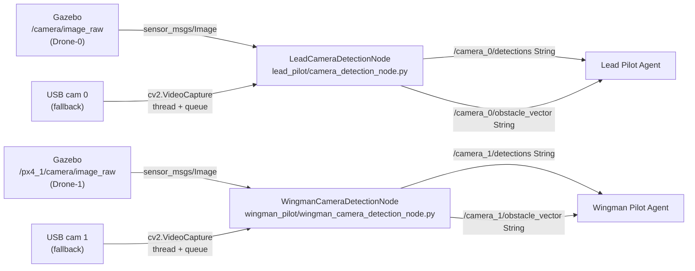

# Part 5: Perception Layer — Camera Detection Nodes

This part implements the vision pipeline for both drones. Each camera node subscribes to a `sensor_msgs/Image` topic published by the Gazebo simulator (or a USB camera fallback), converts frames with `cv_bridge`, runs YOLOv8-nano inference, and publishes human-readable detections plus structured obstacle vectors.

> [!IMPORTANT]
> Camera nodes **must** use `sensor_msgs/Image` + `cv_bridge`, **not** `cv2.VideoCapture` as the primary image source. USB camera mode is a secondary fallback controlled by the `use_usb_camera` parameter.



---

## Directory Structure

```
major_ws/src/major_project/major_project/
├── lead_pilot/
│   └── lead_pilot/
│       └── camera_detection_node.py
└── wingman_pilot/
    └── wingman_pilot/
        └── wingman_camera_detection_node.py
```

---

## Detection Output Formats

### `/camera_X/detections` — Human-readable String
```
Detected 2 obstacle(s): person ahead close, car left medium
```
*(Empty string when no obstacles detected.)*

### `/camera_X/obstacle_vector` — Structured String
```
person:ahead:close|car:left:medium
```
Format: `label:direction:distance` joined by `|`

### Distance Tiers (from bounding-box width as fraction of frame width)

| Tier | Condition |
|---|---|
| `very_close` | bbox_width_frac > 0.30 |
| `close` | 0.10 – 0.30 |
| `medium` | 0.03 – 0.10 |
| `far` | < 0.03 |

### Direction (from bbox center X, normalized −0.5 to +0.5)

| Direction | Condition |
|---|---|
| `left` | center_x_norm < −0.35 |
| `right` | center_x_norm > +0.35 |
| `ahead` | otherwise |

---

## 5.1 Lead Camera Detection Node (`lead_pilot/camera_detection_node.py`)

**Primary mode:** Subscribes to `/camera/image_raw` (`sensor_msgs/Image`), converts via `CvBridge`, runs YOLOv8-nano.  
**USB fallback mode:** `use_usb_camera:=true` — reads from `cv2.VideoCapture` in a daemon thread, puts frames into a `queue.Queue`.

```bash
cat << 'EOF' > ~/major_ws/src/major_project/major_project/lead_pilot/camera_detection_node.py
"""
LeadCameraDetectionNode — Vision node for Drone-0 (Lead Pilot).

PRIMARY MODE  : Subscribes to sensor_msgs/Image, converts via cv_bridge,
                runs YOLOv8-nano inference, publishes detections.
USB FALLBACK  : use_usb_camera:=true  — reads cv2.VideoCapture in a thread.

Subscribes:
    /<image_topic>  (sensor_msgs/Image)   [primary]

Publishes:
    /camera_0/detections      (std_msgs/String)  human-readable
    /camera_0/obstacle_vector (std_msgs/String)  label:dir:dist|... structured

Parameters:
    image_topic          (str)   default: '/camera/image_raw'
    model_path           (str)   default: 'yolov8n.pt'
    confidence_threshold (float) default: 0.4
    publish_rate_hz      (float) default: 2.0
    obstacle_labels      (list)  default: ['person','car','truck','bicycle','bird']
    use_usb_camera       (bool)  default: false
    camera_index         (int)   default: 0

Dependencies:
    pip install ultralytics opencv-python-headless
    pip install cv_bridge  (or install ros-humble-cv-bridge)
"""

from __future__ import annotations

import queue
import threading
import time
from typing import Any, Optional

import rclpy
from rclpy.node import Node
from rclpy.qos import (
    DurabilityPolicy,
    HistoryPolicy,
    QoSProfile,
    ReliabilityPolicy,
)
from std_msgs.msg import String

# ── QoS profiles ─────────────────────────────────────────────────────────────
BEST_EFFORT_QOS = QoSProfile(
    reliability=ReliabilityPolicy.BEST_EFFORT,
    durability=DurabilityPolicy.VOLATILE,
    history=HistoryPolicy.KEEP_LAST,
    depth=1,
)

RELIABLE_QOS = QoSProfile(
    reliability=ReliabilityPolicy.RELIABLE,
    durability=DurabilityPolicy.TRANSIENT_LOCAL,
    history=HistoryPolicy.KEEP_LAST,
    depth=1,
)

# ── Optional vision imports ───────────────────────────────────────────────────
try:
    import cv2
    import numpy as np
    from ultralytics import YOLO
    VISION_AVAILABLE = True
except ImportError:
    VISION_AVAILABLE = False

try:
    from sensor_msgs.msg import Image
    from cv_bridge import CvBridge
    CV_BRIDGE_AVAILABLE = True
except ImportError:
    CV_BRIDGE_AVAILABLE = False

# ── Detection helpers ─────────────────────────────────────────────────────────

def _bbox_to_distance(bbox_width_frac: float) -> str:
    """Map normalised bounding-box width → distance tier string."""
    if bbox_width_frac > 0.30:
        return "very_close"
    if bbox_width_frac > 0.10:
        return "close"
    if bbox_width_frac > 0.03:
        return "medium"
    return "far"


def _bbox_to_direction(center_x_norm: float) -> str:
    """
    Map normalised bbox centre X (range −0.5 to +0.5) → direction string.
    Negative = left side of frame, positive = right.
    """
    if center_x_norm < -0.35:
        return "left"
    if center_x_norm > 0.35:
        return "right"
    return "ahead"


def _run_yolo_on_frame(
    model: Any,
    frame,  # numpy ndarray (BGR)
    confidence: float,
    obstacle_labels: list[str],
) -> tuple[str, str]:
    """
    Run YOLOv8 inference on a single BGR frame.

    Returns:
        detections_text   : human-readable summary string
        obstacle_vector   : 'label:direction:distance|...' structured string
    """
    h, w = frame.shape[:2]
    results = model(frame, verbose=False, conf=confidence)

    items: list[str] = []          # for detections_text
    vectors: list[str] = []        # for obstacle_vector

    for result in results:
        if result.boxes is None:
            continue
        for box in result.boxes:
            cls_id = int(box.cls[0].item())
            label = model.names.get(cls_id, str(cls_id)).lower()
            if label not in obstacle_labels:
                continue

            # Bounding box in pixel space
            x1, y1, x2, y2 = box.xyxy[0].tolist()
            bbox_w = x2 - x1
            bbox_cx = (x1 + x2) / 2.0

            # Normalised values (centre X: −0.5 .. +0.5, width: 0 .. 1)
            cx_norm = (bbox_cx / w) - 0.5
            w_frac  = bbox_w / w

            direction = _bbox_to_direction(cx_norm)
            distance  = _bbox_to_distance(w_frac)

            items.append(f"{label} {direction} {distance}")
            vectors.append(f"{label}:{direction}:{distance}")

    if items:
        count = len(items)
        detections_text = f"Detected {count} obstacle(s): {', '.join(items)}"
    else:
        detections_text = ""

    obstacle_vector = "|".join(vectors)
    return detections_text, obstacle_vector


# ─────────────────────────────────────────────────────────────────────────────
class LeadCameraDetectionNode(Node):
    """
    Camera detection node for Drone-0 (Lead Pilot).

    In primary mode: receives sensor_msgs/Image, converts via CvBridge,
    rate-limits inference to publish_rate_hz, publishes results.

    In USB fallback mode: spawns a background thread that reads
    cv2.VideoCapture and pushes frames into a queue; a timer drains the
    queue at publish_rate_hz.
    """

    def __init__(self) -> None:
        super().__init__("camera_detection_node")

        # ── Parameters ────────────────────────────────────────────────────────
        self.declare_parameter("image_topic",          "/camera/image_raw")
        self.declare_parameter("model_path",           "yolov8n.pt")
        self.declare_parameter("confidence_threshold", 0.4)
        self.declare_parameter("publish_rate_hz",      2.0)
        self.declare_parameter(
            "obstacle_labels",
            ["person", "car", "truck", "bicycle", "bird"],
        )
        self.declare_parameter("use_usb_camera",       False)
        self.declare_parameter("camera_index",         0)

        self._image_topic     = self.get_parameter("image_topic").value
        self._model_path      = self.get_parameter("model_path").value
        self._confidence      = float(self.get_parameter("confidence_threshold").value)
        self._publish_rate_hz = float(self.get_parameter("publish_rate_hz").value)
        self._obstacle_labels = list(self.get_parameter("obstacle_labels").value)
        self._use_usb         = bool(self.get_parameter("use_usb_camera").value)
        self._cam_index       = int(self.get_parameter("camera_index").value)

        # ── Publishers ────────────────────────────────────────────────────────
        self._det_pub = self.create_publisher(
            String, "/camera_0/detections", BEST_EFFORT_QOS
        )
        self._vec_pub = self.create_publisher(
            String, "/camera_0/obstacle_vector", BEST_EFFORT_QOS
        )

        # ── Rate limiter state ────────────────────────────────────────────────
        self._period_sec     = 1.0 / self._publish_rate_hz
        self._last_detect_time: float = 0.0
        self._detect_lock    = threading.Lock()

        # ── YOLO model ────────────────────────────────────────────────────────
        self._model: Optional[Any] = None
        if VISION_AVAILABLE:
            try:
                self._model = YOLO(self._model_path)
                self.get_logger().info(
                    f"YOLOv8 model loaded: {self._model_path}"
                )
            except Exception as exc:
                self.get_logger().error(f"Failed to load YOLO model: {exc}")
        else:
            self.get_logger().warn(
                "ultralytics/cv2 not installed — publishing empty detections. "
                "pip install ultralytics opencv-python-headless"
            )

        # ── Image source ──────────────────────────────────────────────────────
        if self._use_usb:
            self._setup_usb_camera()
        else:
            self._setup_image_subscription()

    # ── Primary mode: sensor_msgs/Image subscription ──────────────────────────

    def _setup_image_subscription(self) -> None:
        if not CV_BRIDGE_AVAILABLE:
            self.get_logger().error(
                "cv_bridge not available — cannot subscribe to Image topic. "
                "Install with: sudo apt install ros-humble-cv-bridge"
            )
            return

        self._bridge = CvBridge()
        self._image_sub = self.create_subscription(
            Image,
            self._image_topic,
            self._on_image,
            BEST_EFFORT_QOS,
        )
        self.get_logger().info(
            f"LeadCameraDetectionNode: subscribed to '{self._image_topic}' (Image)."
        )

    def _on_image(self, msg: "Image") -> None:
        """
        Callback for incoming sensor_msgs/Image messages.
        Rate-limits processing to publish_rate_hz.
        """
        now = time.monotonic()
        with self._detect_lock:
            if now - self._last_detect_time < self._period_sec:
                return  # drop frame — not time yet
            self._last_detect_time = now

        # Convert ROS Image → BGR numpy array
        try:
            frame = self._bridge.imgmsg_to_cv2(msg, desired_encoding="bgr8")
        except Exception as exc:
            self.get_logger().warn(f"cv_bridge conversion error: {exc}")
            return

        # Run inference in a thread to avoid blocking the executor
        threading.Thread(
            target=self._infer_and_publish,
            args=(frame,),
            daemon=True,
        ).start()

    # ── USB fallback mode: cv2.VideoCapture ───────────────────────────────────

    def _setup_usb_camera(self) -> None:
        if not VISION_AVAILABLE:
            self.get_logger().error(
                "cv2 not available — cannot open USB camera."
            )
            return

        self._frame_queue: queue.Queue = queue.Queue(maxsize=2)
        self._cap_thread = threading.Thread(
            target=self._usb_capture_loop, daemon=True
        )
        self._cap_thread.start()

        # Timer drives inference at publish_rate_hz
        self._usb_timer = self.create_timer(
            self._period_sec, self._usb_timer_callback
        )
        self.get_logger().info(
            f"LeadCameraDetectionNode: USB camera mode, index={self._cam_index}."
        )

    def _usb_capture_loop(self) -> None:
        """Background thread: continuously reads frames from USB camera."""
        cap = cv2.VideoCapture(self._cam_index)
        if not cap.isOpened():
            self.get_logger().error(
                f"Cannot open USB camera index={self._cam_index}"
            )
            return

        self.get_logger().info(f"USB camera {self._cam_index} opened.")
        while rclpy.ok():
            ret, frame = cap.read()
            if not ret:
                self.get_logger().warn("USB camera read failed — retrying …")
                time.sleep(0.1)
                continue
            # Drop old frame if queue is full (keep latest)
            if self._frame_queue.full():
                try:
                    self._frame_queue.get_nowait()
                except queue.Empty:
                    pass
            self._frame_queue.put(frame)

        cap.release()

    def _usb_timer_callback(self) -> None:
        """Timer callback: drain latest frame and run inference."""
        try:
            frame = self._frame_queue.get_nowait()
        except queue.Empty:
            return
        threading.Thread(
            target=self._infer_and_publish,
            args=(frame,),
            daemon=True,
        ).start()

    # ── Shared inference + publish logic ──────────────────────────────────────

    def _infer_and_publish(self, frame) -> None:
        """Run YOLO on frame and publish results to both topics."""
        if self._model is not None and VISION_AVAILABLE:
            try:
                det_text, vec_text = _run_yolo_on_frame(
                    self._model,
                    frame,
                    self._confidence,
                    self._obstacle_labels,
                )
            except Exception as exc:
                self.get_logger().warn(f"YOLO inference error: {exc}")
                det_text, vec_text = "", ""
        else:
            det_text, vec_text = "", ""

        det_msg = String()
        det_msg.data = det_text
        self._det_pub.publish(det_msg)

        vec_msg = String()
        vec_msg.data = vec_text
        self._vec_pub.publish(vec_msg)

        if det_text:
            self.get_logger().debug(f"camera_0: {det_text}")


# ─────────────────────────────────────────────────────────────────────────────
def main(args=None) -> None:
    rclpy.init(args=args)
    node = LeadCameraDetectionNode()
    try:
        rclpy.spin(node)
    except KeyboardInterrupt:
        pass
    finally:
        node.destroy_node()
        rclpy.shutdown()


if __name__ == "__main__":
    main()
EOF
```

---

## 5.2 Wingman Camera Detection Node (`wingman_pilot/wingman_camera_detection_node.py`)

The Wingman camera node has its own complete, independent implementation — **not** a copy of the Lead node with renamed topics. It subscribes to Drone-1's Gazebo camera topic and publishes to `/camera_1/*`.

**Key differences from Lead node:**
- Default `image_topic`: `/px4_1/camera/image_raw`
- Publishes to `/camera_1/detections` and `/camera_1/obstacle_vector`
- Node name: `wingman_camera_detection_node`
- Default `camera_index`: `1` (when USB mode is used for physical deployment)

```bash
cat << 'EOF' > ~/major_ws/src/major_project/major_project/wingman_pilot/wingman_camera_detection_node.py
"""
WingmanCameraDetectionNode — Vision node for Drone-1 (Wingman Pilot).

PRIMARY MODE  : Subscribes to sensor_msgs/Image from Drone-1's Gazebo camera,
                converts via cv_bridge, runs YOLOv8-nano inference.
USB FALLBACK  : use_usb_camera:=true  — reads cv2.VideoCapture in a thread.

Subscribes:
    /<image_topic>  (sensor_msgs/Image)   [primary]

Publishes:
    /camera_1/detections      (std_msgs/String)  human-readable
    /camera_1/obstacle_vector (std_msgs/String)  label:dir:dist|... structured

Parameters:
    image_topic          (str)   default: '/px4_1/camera/image_raw'
    model_path           (str)   default: 'yolov8n.pt'
    confidence_threshold (float) default: 0.4
    publish_rate_hz      (float) default: 2.0
    obstacle_labels      (list)  default: ['person','car','truck','bicycle','bird']
    use_usb_camera       (bool)  default: false
    camera_index         (int)   default: 1

Dependencies:
    pip install ultralytics opencv-python-headless
    pip install cv_bridge  (or install ros-humble-cv-bridge)
"""

from __future__ import annotations

import queue
import threading
import time
from typing import Any, Optional

import rclpy
from rclpy.node import Node
from rclpy.qos import (
    DurabilityPolicy,
    HistoryPolicy,
    QoSProfile,
    ReliabilityPolicy,
)
from std_msgs.msg import String

# ── QoS profiles ─────────────────────────────────────────────────────────────
BEST_EFFORT_QOS = QoSProfile(
    reliability=ReliabilityPolicy.BEST_EFFORT,
    durability=DurabilityPolicy.VOLATILE,
    history=HistoryPolicy.KEEP_LAST,
    depth=1,
)

RELIABLE_QOS = QoSProfile(
    reliability=ReliabilityPolicy.RELIABLE,
    durability=DurabilityPolicy.TRANSIENT_LOCAL,
    history=HistoryPolicy.KEEP_LAST,
    depth=1,
)

# ── Optional vision imports ───────────────────────────────────────────────────
try:
    import cv2
    import numpy as np
    from ultralytics import YOLO
    VISION_AVAILABLE = True
except ImportError:
    VISION_AVAILABLE = False

try:
    from sensor_msgs.msg import Image
    from cv_bridge import CvBridge
    CV_BRIDGE_AVAILABLE = True
except ImportError:
    CV_BRIDGE_AVAILABLE = False

# ── Detection helpers (identical algorithm, local to this module) ─────────────

def _bbox_to_distance(bbox_width_frac: float) -> str:
    """Map normalised bounding-box width → distance tier string."""
    if bbox_width_frac > 0.30:
        return "very_close"
    if bbox_width_frac > 0.10:
        return "close"
    if bbox_width_frac > 0.03:
        return "medium"
    return "far"


def _bbox_to_direction(center_x_norm: float) -> str:
    """
    Map normalised bbox centre X (range −0.5 to +0.5) → direction string.
    Negative = left side of frame, positive = right.
    """
    if center_x_norm < -0.35:
        return "left"
    if center_x_norm > 0.35:
        return "right"
    return "ahead"


def _run_yolo_on_frame(
    model: Any,
    frame,  # numpy ndarray (BGR)
    confidence: float,
    obstacle_labels: list[str],
) -> tuple[str, str]:
    """
    Run YOLOv8 inference on a single BGR frame.

    Returns:
        detections_text   : human-readable summary string
        obstacle_vector   : 'label:direction:distance|...' structured string
    """
    h, w = frame.shape[:2]
    results = model(frame, verbose=False, conf=confidence)

    items: list[str] = []
    vectors: list[str] = []

    for result in results:
        if result.boxes is None:
            continue
        for box in result.boxes:
            cls_id = int(box.cls[0].item())
            label = model.names.get(cls_id, str(cls_id)).lower()
            if label not in obstacle_labels:
                continue

            x1, y1, x2, y2 = box.xyxy[0].tolist()
            bbox_w = x2 - x1
            bbox_cx = (x1 + x2) / 2.0

            cx_norm = (bbox_cx / w) - 0.5
            w_frac  = bbox_w / w

            direction = _bbox_to_direction(cx_norm)
            distance  = _bbox_to_distance(w_frac)

            items.append(f"{label} {direction} {distance}")
            vectors.append(f"{label}:{direction}:{distance}")

    if items:
        count = len(items)
        detections_text = f"Detected {count} obstacle(s): {', '.join(items)}"
    else:
        detections_text = ""

    obstacle_vector = "|".join(vectors)
    return detections_text, obstacle_vector


# ─────────────────────────────────────────────────────────────────────────────
class WingmanCameraDetectionNode(Node):
    """
    Camera detection node for Drone-1 (Wingman Pilot).

    In primary mode: receives sensor_msgs/Image from /px4_1/camera/image_raw
    (Drone-1's Gazebo camera), converts via CvBridge, runs YOLOv8-nano,
    publishes to /camera_1/detections and /camera_1/obstacle_vector.

    In USB fallback mode: spawns a background thread reading cv2.VideoCapture
    at camera_index=1 and pushes frames into a queue consumed by a timer.
    """

    def __init__(self) -> None:
        super().__init__("wingman_camera_detection_node")

        # ── Parameters ────────────────────────────────────────────────────────
        self.declare_parameter("image_topic",          "/px4_1/camera/image_raw")
        self.declare_parameter("model_path",           "yolov8n.pt")
        self.declare_parameter("confidence_threshold", 0.4)
        self.declare_parameter("publish_rate_hz",      2.0)
        self.declare_parameter(
            "obstacle_labels",
            ["person", "car", "truck", "bicycle", "bird"],
        )
        self.declare_parameter("use_usb_camera",       False)
        self.declare_parameter("camera_index",         1)

        self._image_topic     = self.get_parameter("image_topic").value
        self._model_path      = self.get_parameter("model_path").value
        self._confidence      = float(self.get_parameter("confidence_threshold").value)
        self._publish_rate_hz = float(self.get_parameter("publish_rate_hz").value)
        self._obstacle_labels = list(self.get_parameter("obstacle_labels").value)
        self._use_usb         = bool(self.get_parameter("use_usb_camera").value)
        self._cam_index       = int(self.get_parameter("camera_index").value)

        # ── Publishers ────────────────────────────────────────────────────────
        self._det_pub = self.create_publisher(
            String, "/camera_1/detections", BEST_EFFORT_QOS
        )
        self._vec_pub = self.create_publisher(
            String, "/camera_1/obstacle_vector", BEST_EFFORT_QOS
        )

        # ── Rate limiter state ────────────────────────────────────────────────
        self._period_sec        = 1.0 / self._publish_rate_hz
        self._last_detect_time: float = 0.0
        self._detect_lock       = threading.Lock()

        # ── YOLO model ────────────────────────────────────────────────────────
        self._model: Optional[Any] = None
        if VISION_AVAILABLE:
            try:
                self._model = YOLO(self._model_path)
                self.get_logger().info(
                    f"YOLOv8 model loaded: {self._model_path}"
                )
            except Exception as exc:
                self.get_logger().error(f"Failed to load YOLO model: {exc}")
        else:
            self.get_logger().warn(
                "ultralytics/cv2 not installed — publishing empty detections. "
                "pip install ultralytics opencv-python-headless"
            )

        # ── Image source ──────────────────────────────────────────────────────
        if self._use_usb:
            self._setup_usb_camera()
        else:
            self._setup_image_subscription()

    # ── Primary mode: sensor_msgs/Image subscription ──────────────────────────

    def _setup_image_subscription(self) -> None:
        if not CV_BRIDGE_AVAILABLE:
            self.get_logger().error(
                "cv_bridge not available — cannot subscribe to Image topic. "
                "Install with: sudo apt install ros-humble-cv-bridge"
            )
            return

        self._bridge = CvBridge()
        self._image_sub = self.create_subscription(
            Image,
            self._image_topic,
            self._on_image,
            BEST_EFFORT_QOS,
        )
        self.get_logger().info(
            f"WingmanCameraDetectionNode: subscribed to '{self._image_topic}' (Image)."
        )

    def _on_image(self, msg: "Image") -> None:
        """
        Callback for incoming sensor_msgs/Image messages from Drone-1.
        Rate-limits processing to publish_rate_hz.
        """
        now = time.monotonic()
        with self._detect_lock:
            if now - self._last_detect_time < self._period_sec:
                return  # drop frame — not time yet
            self._last_detect_time = now

        # Convert ROS Image → BGR numpy array via CvBridge
        try:
            frame = self._bridge.imgmsg_to_cv2(msg, desired_encoding="bgr8")
        except Exception as exc:
            self.get_logger().warn(f"cv_bridge conversion error: {exc}")
            return

        # Run inference off the executor thread
        threading.Thread(
            target=self._infer_and_publish,
            args=(frame,),
            daemon=True,
        ).start()

    # ── USB fallback mode: cv2.VideoCapture ───────────────────────────────────

    def _setup_usb_camera(self) -> None:
        if not VISION_AVAILABLE:
            self.get_logger().error(
                "cv2 not available — cannot open USB camera."
            )
            return

        self._frame_queue: queue.Queue = queue.Queue(maxsize=2)
        self._cap_thread = threading.Thread(
            target=self._usb_capture_loop, daemon=True
        )
        self._cap_thread.start()

        self._usb_timer = self.create_timer(
            self._period_sec, self._usb_timer_callback
        )
        self.get_logger().info(
            f"WingmanCameraDetectionNode: USB camera mode, index={self._cam_index}."
        )

    def _usb_capture_loop(self) -> None:
        """Background thread: continuously reads frames from USB camera at index=1."""
        cap = cv2.VideoCapture(self._cam_index)
        if not cap.isOpened():
            self.get_logger().error(
                f"Cannot open USB camera index={self._cam_index}"
            )
            return

        self.get_logger().info(f"USB camera {self._cam_index} opened.")
        while rclpy.ok():
            ret, frame = cap.read()
            if not ret:
                self.get_logger().warn("USB camera read failed — retrying …")
                time.sleep(0.1)
                continue
            # Always keep only the latest frame
            if self._frame_queue.full():
                try:
                    self._frame_queue.get_nowait()
                except queue.Empty:
                    pass
            self._frame_queue.put(frame)

        cap.release()

    def _usb_timer_callback(self) -> None:
        """Timer callback: drain latest frame and run inference."""
        try:
            frame = self._frame_queue.get_nowait()
        except queue.Empty:
            return
        threading.Thread(
            target=self._infer_and_publish,
            args=(frame,),
            daemon=True,
        ).start()

    # ── Shared inference + publish logic ──────────────────────────────────────

    def _infer_and_publish(self, frame) -> None:
        """Run YOLO on frame and publish results to /camera_1/* topics."""
        if self._model is not None and VISION_AVAILABLE:
            try:
                det_text, vec_text = _run_yolo_on_frame(
                    self._model,
                    frame,
                    self._confidence,
                    self._obstacle_labels,
                )
            except Exception as exc:
                self.get_logger().warn(f"YOLO inference error: {exc}")
                det_text, vec_text = "", ""
        else:
            det_text, vec_text = "", ""

        det_msg = String()
        det_msg.data = det_text
        self._det_pub.publish(det_msg)

        vec_msg = String()
        vec_msg.data = vec_text
        self._vec_pub.publish(vec_msg)

        if det_text:
            self.get_logger().debug(f"camera_1: {det_text}")


# ─────────────────────────────────────────────────────────────────────────────
def main(args=None) -> None:
    rclpy.init(args=args)
    node = WingmanCameraDetectionNode()
    try:
        rclpy.spin(node)
    except KeyboardInterrupt:
        pass
    finally:
        node.destroy_node()
        rclpy.shutdown()


if __name__ == "__main__":
    main()
EOF
```

---

## Build & Verification

```bash
# ── Install vision dependencies ────────────────────────────────────────────────
pip install ultralytics opencv-python-headless numpy

# ROS cv_bridge — install for ROS2 Lyrical (NOT humble)
# Note: this was already declared in package.xml (Part 2) so may already be installed.
# ros-lyrical-vision-opencv includes both cv_bridge and image_geometry.
sudo apt update
sudo apt install -y ros-lyrical-cv-bridge ros-lyrical-vision-opencv

# ── Build both packages ────────────────────────────────────────────────────────
cd ~/major_ws
colcon build --packages-select major_project --symlink-install
source install/setup.bash

# ── Syntax check (no ROS daemon needed) ──────────────────────────────────────
python3 -c "
import ast, pathlib, sys
nodes = [
    'src/major_project/major_project/lead_pilot/camera_detection_node.py',
    'src/major_project/major_project/wingman_pilot/wingman_camera_detection_node.py',
]
ok = True
for p in nodes:
    try:
        ast.parse(pathlib.Path(p).read_text())
        print(f'  ✅ {p}')
    except SyntaxError as e:
        print(f'  ❌ {p}: {e}')
        ok = False
sys.exit(0 if ok else 1)
"

# ── Run nodes ─────────────────────────────────────────────────────────────────
# Terminal A: Lead camera (primary Image mode)
ros2 run major_project camera_detection_node \
  --ros-args -p image_topic:=/camera/image_raw -p publish_rate_hz:=2.0

# Terminal B: Lead camera (USB fallback mode)
ros2 run major_project camera_detection_node \
  --ros-args -p use_usb_camera:=true -p camera_index:=0

# Terminal C: Wingman camera (primary Image mode)
ros2 run major_project wingman_camera_detection_node \
  --ros-args -p image_topic:=/px4_1/camera/image_raw -p publish_rate_hz:=2.0

# Terminal D: Wingman camera (USB fallback)
ros2 run major_project wingman_camera_detection_node \
  --ros-args -p use_usb_camera:=true -p camera_index:=1

# ── Monitor detection outputs ─────────────────────────────────────────────────
ros2 topic echo /camera_0/detections
ros2 topic echo /camera_0/obstacle_vector
ros2 topic echo /camera_1/detections
ros2 topic echo /camera_1/obstacle_vector

# ── Check publish rates ───────────────────────────────────────────────────────
ros2 topic hz /camera_0/detections
ros2 topic hz /camera_1/detections

# ── Inject a test Image message (requires sensor_msgs) ───────────────────────
# Publish a blank 320x240 image to test the pipeline
python3 - << 'EOF'
import rclpy
from rclpy.node import Node
from sensor_msgs.msg import Image
from rclpy.qos import QoSProfile, ReliabilityPolicy, DurabilityPolicy, HistoryPolicy
import numpy as np

rclpy.init()
node = Node("test_image_pub")
qos = QoSProfile(
    reliability=ReliabilityPolicy.BEST_EFFORT,
    durability=DurabilityPolicy.VOLATILE,
    history=HistoryPolicy.KEEP_LAST,
    depth=1,
)
pub = node.create_publisher(Image, "/camera/image_raw", qos)

msg = Image()
msg.header.stamp = node.get_clock().now().to_msg()
msg.header.frame_id = "camera_link"
msg.height = 240
msg.width  = 320
msg.encoding = "bgr8"
msg.step = 320 * 3
msg.data = bytes(240 * 320 * 3)  # black frame

import time
for i in range(10):
    msg.header.stamp = node.get_clock().now().to_msg()
    pub.publish(msg)
    print(f"Published frame {i+1}/10")
    time.sleep(0.5)

node.destroy_node()
rclpy.shutdown()
EOF
```

---

## Parameter Reference

### Lead Camera Detection Node

| Parameter | Type | Default | Description |
|---|---|---|---|
| `image_topic` | string | `/camera/image_raw` | ROS Image topic to subscribe to |
| `model_path` | string | `yolov8n.pt` | YOLOv8 model file path |
| `confidence_threshold` | float | `0.4` | YOLO detection confidence cutoff |
| `publish_rate_hz` | float | `2.0` | Max inference + publish rate |
| `obstacle_labels` | list | `[person,car,truck,bicycle,bird]` | YOLO classes to report |
| `use_usb_camera` | bool | `false` | Enable USB VideoCapture fallback |
| `camera_index` | int | `0` | USB camera device index |

### Wingman Camera Detection Node

| Parameter | Type | Default | Description |
|---|---|---|---|
| `image_topic` | string | `/px4_1/camera/image_raw` | Drone-1 Gazebo camera topic |
| `model_path` | string | `yolov8n.pt` | YOLOv8 model file path |
| `confidence_threshold` | float | `0.4` | YOLO detection confidence cutoff |
| `publish_rate_hz` | float | `2.0` | Max inference + publish rate |
| `obstacle_labels` | list | `[person,car,truck,bicycle,bird]` | YOLO classes to report |
| `use_usb_camera` | bool | `false` | Enable USB VideoCapture fallback |
| `camera_index` | int | `1` | USB camera device index (Drone-1) |

---

## Topic Summary

| Topic | Type | Publisher | QoS |
|---|---|---|---|
| `/camera/image_raw` | `sensor_msgs/Image` | Gazebo / USB thread | BEST_EFFORT / VOLATILE |
| `/px4_1/camera/image_raw` | `sensor_msgs/Image` | Gazebo / USB thread | BEST_EFFORT / VOLATILE |
| `/camera_0/detections` | `std_msgs/String` | LeadCameraDetectionNode | BEST_EFFORT / VOLATILE |
| `/camera_0/obstacle_vector` | `std_msgs/String` | LeadCameraDetectionNode | BEST_EFFORT / VOLATILE |
| `/camera_1/detections` | `std_msgs/String` | WingmanCameraDetectionNode | BEST_EFFORT / VOLATILE |
| `/camera_1/obstacle_vector` | `std_msgs/String` | WingmanCameraDetectionNode | BEST_EFFORT / VOLATILE |

---

## Design Notes

> [!TIP]
> **Rate limiting strategy**: Both nodes use a `_last_detect_time` float and a `threading.Lock()` inside `_on_image` to skip frames that arrive faster than `1.0 / publish_rate_hz`. This is lightweight — no timer or asyncio needed.

> [!NOTE]
> **Why `desired_encoding="bgr8"`?** OpenCV and YOLOv8 both expect BGR channel order. `CvBridge.imgmsg_to_cv2(..., desired_encoding="bgr8")` handles conversion from any ROS Image encoding (rgb8, mono8, etc.) automatically.

> [!WARNING]
> **USB mode queue overflow**: The `queue.Queue(maxsize=2)` with an explicit `get_nowait()` discard ensures that a slow inference loop never accumulates a backlog of stale frames. Always process the newest frame.

> [!NOTE]
> **Thread safety**: `_infer_and_publish` is called from a spawned daemon thread, not the ROS executor thread. ROS 2 publishers are thread-safe in Python (GIL-protected), so no additional lock is needed around `publish()` calls.

---

*Part 5 complete — the full perception pipeline is now wired. Continue to Part 6 for the Lead Pilot Agent integration.*
