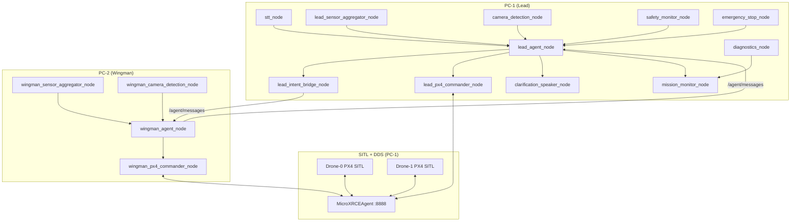

# Part 10 — Configuration, Launch Files & Deployment

> **Series position:** This is the final part of the drone swarm tutorial. It brings every component built in Parts 1–9 together into a single deployable system.

---

## Table of Contents

1. [10.1 `lead_config.yaml` — Complete Final Config](#101-lead_configyaml--complete-final-config)
2. [10.2 `wingman_config.yaml` — Complete Final Config](#102-wingman_configyaml--complete-final-config)
3. [10.3 `lead_pilot.launch.py` — PC-1 Launch File](#103-lead_pilotlaunchpy--pc-1-launch-file)
4. [10.4 `wingman_pilot.launch.py` — PC-2 Launch File](#104-wingman_pilotlaunchpy--pc-2-launch-file)
5. [10.5 Final Build Steps](#105-final-build-steps)
6. [10.6 Deployment Sequence](#106-deployment-sequence-strict-order)
7. [10.7 End-to-End Test Commands](#107-end-to-end-test-commands)
8. [10.8 Troubleshooting Guide](#108-troubleshooting-guide)

---

## 10.1 `lead_config.yaml` — Complete Final Config

**File:** `config/lead_config.yaml`

This single YAML file supplies `ros__parameters` to every node launched on **PC-1**. The four logical layers (Sensor → Safety → Intelligence → Execution) are each clearly delimited.

```bash
cat << 'EOF' > ~/major_ws/src/major_project/config/lead_config.yaml
# ── Sensor layer ──────────────────────────────────────────────────────────────
lead_sensor_aggregator_node:
  ros__parameters:
    publish_rate_hz: 1.0
    min_separation_m: 5.0          # proximity warning threshold

camera_detection_node:
  ros__parameters:
    image_topic: "/camera/image_raw"
    use_usb_camera: false
    camera_index: 0
    model_path: "yolov8n.pt"
    confidence_threshold: 0.4
    publish_rate_hz: 2.0
    obstacle_labels: ["person", "car", "truck", "bicycle", "bird"]

# ── Safety layer ──────────────────────────────────────────────────────────────
safety_monitor_node:
  ros__parameters:
    battery_warn_pct: 20.0
    battery_rtl_pct: 15.0
    min_separation_m: 5.0
    proximity_warn_interval_sec: 5.0

# ── Intelligence layer ────────────────────────────────────────────────────────
lead_agent_node:
  ros__parameters:
    ollama_host: "localhost"
    ollama_port: 11434
    model: "qwen3.5:2b"
    num_ctx: 2048

# ── Execution layer ───────────────────────────────────────────────────────────
lead_px4_commander_node:
  ros__parameters:
    drone_namespace: ""     # Drone-0 uses default /fmu/ namespace

lead_intent_bridge_node:
  ros__parameters:
    chain_step_delay_sec: 6.0
EOF
```

> [!NOTE]
> `drone_namespace: ""` for Drone-0 means topics resolve to `/fmu/in/...` and `/fmu/out/...` — the PX4 SITL default. Drone-1 on PC-2 uses `"px4_1"` so its topics are `/px4_1/fmu/in/...`.

---

## 10.2 `wingman_config.yaml` — Complete Final Config

**File:** `config/wingman_config.yaml`

This file is deployed and loaded on **PC-2** only. The wingman stack is intentionally leaner: no safety monitor (Lead handles swarm-level safety), no intent bridge (wingman is a follower), and a smaller SLM context window.

```bash
cat << 'EOF' > ~/major_ws/src/major_project/config/wingman_config.yaml
# ── Sensor layer ──────────────────────────────────────────────────────────────
wingman_sensor_aggregator_node:
  ros__parameters:
    publish_rate_hz: 1.0

wingman_camera_detection_node:
  ros__parameters:
    image_topic: "/px4_1/camera/image_raw"
    use_usb_camera: false
    camera_index: 1
    model_path: "yolov8n.pt"
    confidence_threshold: 0.4
    publish_rate_hz: 2.0
    obstacle_labels: ["person", "car", "truck", "bicycle", "bird"]

# ── Intelligence layer ────────────────────────────────────────────────────────
wingman_agent_node:
  ros__parameters:
    ollama_host: "localhost"
    ollama_port: 11434
    model: "qwen3.5:2b"
    num_ctx: 1024

# ── Execution layer ───────────────────────────────────────────────────────────
wingman_px4_commander_node:
  ros__parameters:
    drone_namespace: "px4_1"
EOF
```

> [!TIP]
> `num_ctx: 1024` for the wingman halves the SLM memory footprint. The wingman's tool calls are narrower (fly / hover / report), so the smaller context is sufficient and leaves more GPU/CPU headroom on PC-2.

---

## 10.3 `lead_pilot.launch.py` — PC-1 Launch File

**File:** `launch/lead_pilot.launch.py`

Launches **all 11 nodes** that run on PC-1. The diagnostics node runs here (not PC-2) because it can observe both PC-1 and PC-2 topics transparently via CycloneDDS.

Nodes that carry ROS parameters receive `parameters=[cfg]`. Stateless utility nodes (`stt_node`, `clarification_speaker`, `mission_monitor`, `emergency_stop`, `diagnostics`) need no parameter file.

```bash
cat << 'EOF' > ~/major_ws/src/major_project/launch/lead_pilot.launch.py
import os
from ament_index_python.packages import get_package_share_directory
from launch import LaunchDescription
from launch_ros.actions import Node


def generate_launch_description():
    pkg_share = get_package_share_directory("major_project")
    cfg = os.path.join(pkg_share, "config", "lead_config.yaml")

    return LaunchDescription([

        # ── Sensor layer ──────────────────────────────────────────────────────
        Node(
            package="major_project",
            executable="lead_sensor_aggregator",
            name="lead_sensor_aggregator_node",
            parameters=[cfg],
            output="screen",
        ),
        Node(
            package="major_project",
            executable="camera_detection",
            name="camera_detection_node",
            parameters=[cfg],
            output="screen",
        ),

        # ── Safety layer ──────────────────────────────────────────────────────
        Node(
            package="major_project",
            executable="safety_monitor",
            name="safety_monitor_node",
            parameters=[cfg],
            output="screen",
        ),

        # ── Intelligence layer ────────────────────────────────────────────────
        Node(
            package="major_project",
            executable="lead_agent",
            name="lead_agent_node",
            parameters=[cfg],
            output="screen",
        ),

        # ── Execution layer ───────────────────────────────────────────────────
        Node(
            package="major_project",
            executable="lead_px4_commander",
            name="lead_px4_commander_node",
            parameters=[cfg],
            output="screen",
        ),
        Node(
            package="major_project",
            executable="lead_intent_bridge",
            name="lead_intent_bridge_node",
            parameters=[cfg],
            output="screen",
        ),

        # ── Human-interface layer ─────────────────────────────────────────────
        Node(
            package="major_project",
            executable="stt_node",
            name="stt_node",
            output="screen",
        ),
        Node(
            package="major_project",
            executable="clarification_speaker",
            name="clarification_speaker_node",
            output="screen",
        ),

        # ── Monitoring layer ──────────────────────────────────────────────────
        Node(
            package="major_project",
            executable="mission_monitor",
            name="mission_monitor_node",
            output="screen",
        ),
        Node(
            package="major_project",
            executable="emergency_stop",
            name="emergency_stop_node",
            output="screen",
        ),
        Node(
            package="major_project",
            executable="diagnostics",
            name="diagnostics_node",
            output="screen",
        ),
    ])
EOF
```

> [!IMPORTANT]
> The Lead Agent self-starts with a STANDBY goal on boot — **no voice command is required to initialise autonomy**. The STT node listens for mission goals and preemption commands only.

---

## 10.4 `wingman_pilot.launch.py` — PC-2 Launch File

**File:** `launch/wingman_pilot.launch.py`

Launches the **4 nodes** that run on PC-2. Always start this *after* the Lead stack on PC-1 is healthy, so that the wingman's first topic subscriptions succeed immediately.

```bash
cat << 'EOF' > ~/major_ws/src/major_project/launch/wingman_pilot.launch.py
import os
from ament_index_python.packages import get_package_share_directory
from launch import LaunchDescription
from launch_ros.actions import Node


def generate_launch_description():
    pkg_share = get_package_share_directory("major_project")
    cfg = os.path.join(pkg_share, "config", "wingman_config.yaml")

    return LaunchDescription([

        # ── Sensor layer ──────────────────────────────────────────────────────
        Node(
            package="major_project",
            executable="wingman_sensor_aggregator",
            name="wingman_sensor_aggregator_node",
            parameters=[cfg],
            output="screen",
        ),
        Node(
            package="major_project",
            executable="wingman_camera_detection",
            name="wingman_camera_detection_node",
            parameters=[cfg],
            output="screen",
        ),

        # ── Intelligence layer ────────────────────────────────────────────────
        Node(
            package="major_project",
            executable="wingman_agent",
            name="wingman_agent_node",
            parameters=[cfg],
            output="screen",
        ),

        # ── Execution layer ───────────────────────────────────────────────────
        Node(
            package="major_project",
            executable="wingman_intent_bridge",
            name="wingman_intent_bridge_node",
            parameters=[cfg],
            output="screen",
        ),
        Node(
            package="major_project",
            executable="wingman_px4_commander",
            name="wingman_px4_commander_node",
            parameters=[cfg],
            output="screen",
        ),
    ])
EOF
```

> [!NOTE]
> `wingman_camera_detection_node` is new in this final configuration. It mirrors `camera_detection_node` on PC-1 but subscribes to `/px4_1/camera/image_raw` and publishes detections on `/camera_1/detections`.

---

## 10.5 Final Build Steps

### PC-1 Build

```bash
cd ~/major_ws
colcon build --packages-select major_project --symlink-install
source install/setup.bash
```

### Verify All Entry Points

After a successful build, confirm all 16 executables are registered:

```bash
ros2 pkg executables major_project
```

**Expected output** (order may vary):

```
major_project camera_detection
major_project clarification_speaker
major_project diagnostics
major_project emergency_stop
major_project lead_agent
major_project lead_intent_bridge
major_project lead_px4_commander
major_project lead_sensor_aggregator
major_project mission_monitor
major_project safety_monitor
major_project stt_node
major_project wingman_agent
major_project wingman_camera_detection
major_project wingman_intent_bridge
major_project wingman_px4_commander
major_project wingman_sensor_aggregator
```

> [!WARNING]
> If any executable is missing, check the corresponding `entry_points` block in `setup.py`. A typo in the console script name will cause a silent omission — `colcon build` will succeed but the node will not be launchable.

### Smoke Test All Core Imports

Run this inline Python script to validate every shared module before launching hardware:

```bash
python3 - << 'EOF'
import sys, os
sys.path.insert(0, os.path.expanduser('~/major_ws/src/major_project'))

from major_project.common.schemas import FlightIntent, AgentMessage
from major_project.common.context_manager import ContextManager
from major_project.common.agent_memory import AgentMemory
from major_project.common.tool_registry import LeadToolRegistry, WingmanToolRegistry
from major_project.common.ollama_client import OllamaClient
print("All imports OK")

# ── AgentMessage ──────────────────────────────────────────────────────────────
msg = AgentMessage(type='task', sender='LEAD', content='test')
print(f"AgentMessage OK: {msg.model_dump_json()}")

# ── ContextManager ────────────────────────────────────────────────────────────
ctx = ContextManager()
ctx.set_goal("find football")
ctx.update_situation("bat:90% alt:0m mode:MANUAL gps:OK")
ctx.add_tool_result("get_situation", {}, "bat:90% alt:0m")
ctx.add_tool_result("takeoff", {"altitude": 10}, "Takeoff initiated. Ascending to 10m. ETA ~25s.")
prompt = ctx.build_prompt()
assert "[MISSION GOAL]" in prompt
assert "[CURRENT SITUATION]" in prompt
assert "[RECENT ACTIONS]" in prompt
print("ContextManager OK")

# ── History compression ───────────────────────────────────────────────────────
for i in range(15):
    ctx.add_tool_result(f"tool_{i}", {"x": i}, f"result_{i}")
assert len(ctx.history) <= 12
assert "Earlier" in ctx.memory_block
print("Compression OK")

# ── AgentMemory ───────────────────────────────────────────────────────────────
mem = AgentMemory(db_name="test_smoke.db")
mem.clear()
mem.remember("football found at N50m")
results = mem.recall("football")
assert len(results) == 1
mem.clear()
os.remove(os.path.expanduser("~/.ros/test_smoke.db"))
print("AgentMemory OK")

print("\nAll smoke tests passed!")
EOF
```

> [!IMPORTANT]
> All five assertions must pass before you proceed to hardware. A failure here means a shared module is broken and **will** cause a node crash mid-mission.

### Sync Source to PC-2

```bash
rsync -av --progress --exclude='*.pyc' --exclude='__pycache__' \
  ~/major_ws/src/major_project/ dev@<PC2_IP>:~/major_ws/src/major_project/
```

> [!TIP]
> Find `<PC2_IP>` by running `hostname -I | awk '{print $1}'` on **PC-1** (both machines on the same LAN). If you have set up SSH key-based auth, the rsync will be non-interactive.

### PC-2 Build

```bash
# On PC-2:
cd ~/major_ws
colcon build --packages-select major_project --symlink-install
source install/setup.bash
```

---

## 10.6 Deployment Sequence (Strict Order)

> [!CAUTION]
> Do **not** skip or reorder these steps. Each step has a mandatory gate condition. Starting the next step before the gate passes is the single most common cause of mission failure in testing.

**Recommended terminal layout:** Use `tmux` with 5 panes on PC-1 + 1 terminal on PC-2.

---

### STEP 1 — PC-1: Launch Drone-0 SITL

```bash
cd ~/PX4-Autopilot
PX4_SYS_AUTOSTART=4010 PX4_GZ_MODEL=x500_mono_cam \
PX4_GZ_MODEL_POSE="0,0,0,0,0,0" PX4_UXRCE_DDS_KEY=1 \
./build/px4_sitl_default/bin/px4 -i 0 -d
```

**✅ Gate:** Wait for `[commander] Ready for takeoff!` in the PX4 shell output before proceeding.

---

### STEP 2 — PC-1: Launch Drone-1 SITL

```bash
cd ~/PX4-Autopilot
PX4_SYS_AUTOSTART=4010 PX4_GZ_MODEL=x500_mono_cam \
PX4_GZ_MODEL_POSE="5,0,0,0,0,0" PX4_UXRCE_DDS_KEY=2 \
./build/px4_sitl_default/bin/px4 -i 1 -d
```

**✅ Gate:** Wait for `[commander] Ready for takeoff!` in Drone-1's shell before proceeding.

> [!NOTE]
> Drone-1 is spawned at `x=5 m` offset to avoid collisions with Drone-0 at origin. The `PX4_UXRCE_DDS_KEY=2` ensures each drone gets a unique DDS session.

---

### STEP 3 — PC-1: Start DDS Agent

```bash
source ~/.bashrc
MicroXRCEAgent udp4 -p 8888
```

**✅ Gate:** The agent must log **two** client connection lines — one for each drone:

```
[XRCE-DDS Agent] [info] ... Session established with client key: 0x00000001
[XRCE-DDS Agent] [info] ... Session established with client key: 0x00000002
```

> [!WARNING]
> If only one connection appears, one SITL instance did not start cleanly. Check its terminal for errors. Do **not** launch ROS nodes with only one drone connected — the wingman PX4 commander will spin endlessly waiting for telemetry.

---

### STEP 4 — PC-1: Launch Lead Stack

```bash
# Terminal 4
source ~/major_ws/install/setup.bash

# Suppress harmless CycloneDDS PX4 type hash mismatch warnings
export RCUTILS_CONSOLE_OUTPUT_FORMAT="[{severity}] [{name}]: {message}"

ros2 launch major_project lead_pilot.launch.py
```

**✅ Gate:** All 11 nodes must emit a `"ready"` or `"initialised"` log line. Specifically watch for:
- `lead_agent_node` — `"Lead Agent standing by"`
- `safety_monitor_node` — `"Safety monitor active"`
- `diagnostics_node` — `"Diagnostics node started"`

> [!IMPORTANT]
> The Lead Agent self-starts with a **STANDBY** goal. No voice command is needed to initialise autonomy. The first spoken goal will immediately preempt standby and begin mission execution.

---

### STEP 5 — PC-2: Launch Wingman Stack

```bash
# Terminal 5 (on PC-2)
source ~/major_ws/install/setup.bash

# Suppress harmless CycloneDDS PX4 type hash mismatch warnings
export RCUTILS_CONSOLE_OUTPUT_FORMAT="[{severity}] [{name}]: {message}"

ros2 launch major_project wingman_pilot.launch.py
```

**✅ Gate:** All 4 nodes initialise. Watch for:
- `wingman_agent_node` — `"Wingman Agent standing by"`
- `wingman_px4_commander_node` — `"Offboard commander ready"`

---

### STEP 6 — PC-1: Diagnostics Health Check

```bash
ros2 topic echo /system/health
```

**✅ Gate:** Within ~30 seconds, `all_ok` must be `true`:

```yaml
stamp:
  sec: 1750000000
  nanosec: 0
all_ok: true
node_statuses:
  - name: lead_agent_node       status: OK
  - name: wingman_agent_node    status: OK
  - name: safety_monitor_node   status: OK
  - name: diagnostics_node      status: OK
  ...
```

Only after this gate is green is the swarm ready to accept a mission goal.

---

## 10.7 End-to-End Test Commands

Run these **in order**. Each test builds on the system state left by the previous one.

---

### Test 1 — Boot Autonomy (No Voice Required)

**Purpose:** Confirm the Lead Agent enters STANDBY without needing a voice trigger.

```bash
# On PC-1, in a new terminal:
ros2 topic echo /mission_status
```

**Expected:** Within 10 s of launch, `/mission_status` publishes:

```
status: "STANDBY"
goal: ""
active_drone: "LEAD"
```

**Pass criterion:** Topic is publishing and `status == "STANDBY"`.

---

### Test 2 — Goal Preemption

**Purpose:** A second voice command aborts the first mission and starts the new one.

```bash
# Speak or inject goal 1:
ros2 topic pub --once /voice_commands std_msgs/msg/String "data: 'search the north field'"

# Wait 5 s, then inject goal 2:
ros2 topic pub --once /voice_commands std_msgs/msg/String "data: 'return to home immediately'"

# Monitor:
ros2 topic echo /mission_status
```

**Expected sequence:**
1. Status transitions to `EXECUTING` with goal `"search the north field"`
2. After second pub, status transitions to `ABORTING` then `EXECUTING` with goal `"return to home immediately"`

**Pass criterion:** Abort is confirmed in logs and new goal executes without requiring a node restart.

---

### Test 3 — Non-Blocking Human Escalation

**Purpose:** When a person obstacle is detected, the agent publishes a clarification question *and keeps running* (does not block).

```bash
# Inject a synthetic person detection:
ros2 topic pub --once /camera_0/detections \
  major_project_msgs/msg/DetectionArray \
  "{detections: [{label: 'person', confidence: 0.85, x: 320, y: 240}]}"

# Monitor:
ros2 topic echo /clarification_request
ros2 topic echo /mission_status   # must still show EXECUTING
```

**Expected:**
- `/clarification_request` receives a question (e.g. `"Person detected ahead. Continue or hold?"`)
- `/mission_status` continues to show `EXECUTING` — agent is **not** blocking

**Pass criterion:** Both topics publish within 5 s of the injected detection.

---

### Test 4 — SLM Health Fallback

**Purpose:** If Ollama fails repeatedly, the safety monitor triggers RTL.

```bash
# Stop Ollama on PC-1:
sudo systemctl stop ollama   # or: pkill ollama

# Watch for RTL trigger:
ros2 topic echo /safety/alert
ros2 topic echo /mission_status
```

**Expected:**
- After 5 consecutive SLM failures (~30 s), `/safety/alert` publishes `reason: "SLM_UNAVAILABLE"`
- Both drones enter RTL mode
- `/mission_status` transitions to `RTL`

**Pass criterion:** RTL is triggered without any manual intervention.

```bash
# Restore Ollama after test:
sudo systemctl start ollama
```

---

### Test 5 — Camera Vision Pipeline

**Purpose:** Confirm both drones' detection topics are publishing.

```bash
# Check Lead (Drone-0) detections:
ros2 topic echo /camera_0/detections

# Check Wingman (Drone-1) detections:
ros2 topic echo /camera_1/detections

# Verify publish rate (~2 Hz):
ros2 topic hz /camera_0/detections
ros2 topic hz /camera_1/detections
```

**Expected:** Both topics publish at ~2 Hz. Detection lists may be empty if the Gazebo scene has no YOLO-labelled objects — that is fine; the important thing is the topic exists and publishes.

**Pass criterion:** Both topics present, both publishing at ≥1 Hz.

---

### Test 6 — Full 2-Drone Coordination (Split Mission)

**Purpose:** Lead delegates a parallel sub-task to the Wingman.

```bash
# Issue a split mission goal:
ros2 topic pub --once /voice_commands std_msgs/msg/String \
  "data: 'search the field — lead take north, wingman take south'"

# Monitor both drones:
ros2 topic echo /mission_status
ros2 topic echo /wingman/status

# Monitor delegation message:
ros2 topic echo /agent/messages
```

**Expected:**
- Lead Agent publishes a `task` message to `/agent/messages` addressed to `WINGMAN`
- Wingman Agent acknowledges with a `status` reply
- Both drones take off and diverge toward their assigned sectors
- Gazebo visualisation confirms spatial separation

**Pass criterion:** Both `/mission_status` and `/wingman/status` show `EXECUTING` with different goal strings.

---

### Test 7 — Emergency Stop

**Purpose:** Hardware E-stop immediately lands both drones.

```bash
# Publish emergency stop:
ros2 topic pub --once /emergency_stop std_msgs/msg/Bool "data: true"

# Monitor:
ros2 topic echo /mission_status
ros2 topic echo /wingman/status
```

**Expected:**
- Both nodes immediately publish `status: "EMERGENCY_LAND"`
- Both drones descend and disarm in Gazebo
- No further tool calls are made by either agent until the system is restarted

**Pass criterion:** Both drones land within 10 s of the E-stop signal with no errors in logs.

---

## 10.8 Troubleshooting Guide

| Symptom | Most Likely Cause | Fix |
|---|---|---|
| `"Camera not available"` in `camera_detection_node` logs | `image_topic` param does not match the Gazebo topic name | Run `ros2 topic list \| grep camera` and update `image_topic` in the relevant config YAML to match exactly |
| Wingman not receiving Lead messages on `/agent/messages` | CycloneDDS multicast blocked or wrong network interface | Check `CYCLONEDDS_URI` on both PCs points to `wlan0` (or whichever interface they share); confirm with `ping <PC2_IP>` from PC-1 |
| SLM keeps timing out / `OllamaConnectionError` in logs | Ollama server not running or wrong port | Run `curl http://localhost:11434/api/tags` — if it fails, start with `ollama serve`; also check `ollama_port` param matches |
| Drone exits Offboard mode mid-flight | DDS heartbeat interrupted (MicroXRCE Agent crash or network blip) | Confirm `MicroXRCEAgent udp4 -p 8888` is still running; restart it if needed; the PX4 commander will re-enter Offboard on the next setpoint |
| Both drones occupy same position (collision risk at launch) | `lead_sensor_aggregator` not subscribed to wingman position | Check `min_separation_m` in `lead_config.yaml`; verify `/px4_1/fmu/out/vehicle_local_position` is reachable on PC-1 via `ros2 topic echo` |

---

### Additional Diagnostic Commands

```bash
# List all active nodes across both PCs:
ros2 node list

# Check topic publish rates:
ros2 topic hz /fmu/out/vehicle_status
ros2 topic hz /px4_1/fmu/out/vehicle_status

# Inspect DDS discovery:
ros2 daemon status

# Verify Ollama model is loaded:
curl http://localhost:11434/api/tags | python3 -m json.tool

# Check CycloneDDS interface config:
echo $CYCLONEDDS_URI
cat /etc/cyclonedds/cyclonedds.xml   # or wherever your URI points

# Full system graph:
ros2 run rqt_graph rqt_graph
```

---

## Architecture Summary



---

## 10.7 Multi-PC Simulation (Optional)

To distribute compute across multiple PCs (e.g., PC1 and PC2), you must account for two critical factors:
1. **The Physical World:** Gazebo is a single physics engine. You cannot launch PX4 instance 0 on PC1 and instance 1 on PC2 because they will spawn in parallel, isolated Gazebo windows and will never see each other.
2. **Network Discovery:** ROS2 default UDP multicast discovery often fails over standard Wi-Fi routers.

To properly distribute load, run the **Physical World (Gazebo + both PX4s + Commander Nodes)** on PC1, and the **AI Brains (LLM Agents)** on PC2. 

### Step 1: CycloneDDS Configuration
Create a CycloneDDS configuration file on **both** PCs (`~/cyclonedds.xml`) to bypass multicast dropping:

```xml
<?xml version="1.0" encoding="UTF-8" ?>
<CycloneDDS xmlns="https://cdds.io/config">
  <Domain id="any">
    <General>
      <!-- Change wlan0 to your network interface (e.g., eth0) -->
      <NetworkInterfaceAddress>wlan0</NetworkInterfaceAddress>
      <AllowMulticast>true</AllowMulticast>
    </General>
    <Discovery>
      <ParticipantIndex>auto</ParticipantIndex>
      <Peers>
        <Peer Address="IP_OF_PC1" />
        <Peer Address="IP_OF_PC2" />
      </Peers>
    </Discovery>
  </Domain>
</CycloneDDS>
```

Before launching any ROS2 or PX4 terminals on either PC, export the following variables:
```bash
export ROS_DOMAIN_ID=0
export RMW_IMPLEMENTATION=rmw_cyclonedds_cpp
export CYCLONEDDS_URI=~/cyclonedds.xml
```

### Step 2: Launch PC1 (The Physical World)
Open four terminals on PC1 (exporting variables in each):
- Terminal 1: `MicroXRCEAgent udp4 -p 8888`
- Terminal 2: `PX4_SYS_AUTOSTART=4010 PX4_GZ_MODEL=x500_mono_cam PX4_UXRCE_DDS_KEY=1 ./build/px4_sitl_default/bin/px4 -i 0 -d`
- Terminal 3: `PX4_SYS_AUTOSTART=4010 PX4_GZ_MODEL=x500_mono_cam PX4_GZ_MODEL_POSE="5,0,0,0,0,0" PX4_UXRCE_DDS_KEY=2 ./build/px4_sitl_default/bin/px4 -i 1 -d`
- Terminal 4: `ros2 run major_project lead_px4_commander` & `ros2 run major_project wingman_px4_commander` (or use a custom launch file that only launches non-Agent nodes).

### Step 3: Launch PC2 (The AI Brains)
Open a terminal on PC2 (exporting variables):
- Terminal 1: `ros2 run major_project lead_agent`
- Terminal 2: `ros2 run major_project wingman_agent`

The heavy AI processing will happen on PC2 and beam decisions instantly over Wi-Fi to the commanders running on PC1.

*Note: For QGroundControl telemetry across PCs, enable `MAV_0_BROADCAST=1` and `MAV_1_BROADCAST=1` in QGC parameters on PC1.*

---

> [!NOTE]
> This completes the 10-part drone swarm tutorial series. The system is now fully specified, built, tested, and deployable. For production use, replace the SITL PX4 instances with real hardware, swap `use_usb_camera: true` with live camera feeds, and adjust `battery_rtl_pct` thresholds to match your battery chemistry.
